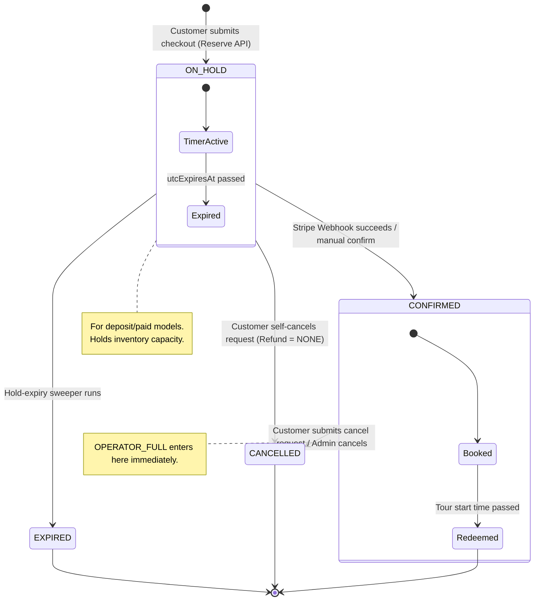
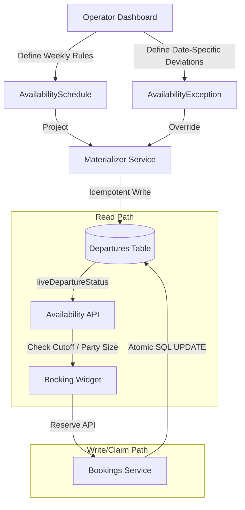
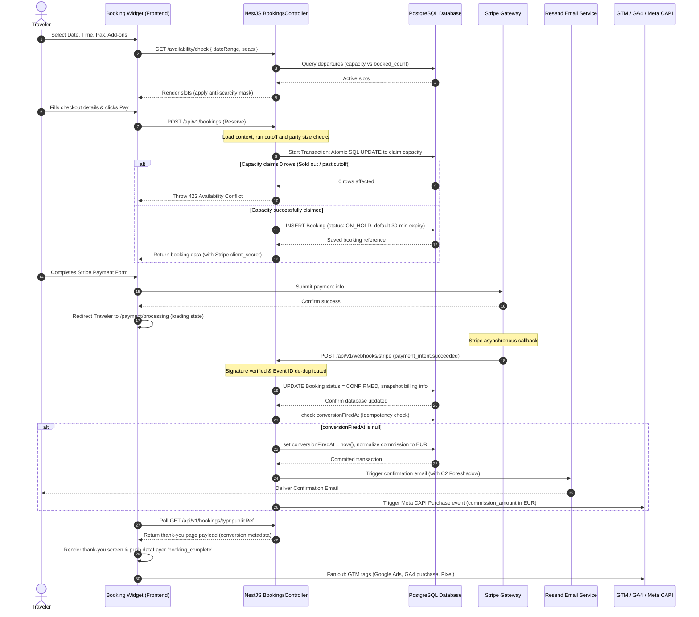

# Island Tours: Booking Module Design Specification & Architecture

This document defines the complete booking flow, backend data schemas, business logic, edge cases, and state transitions for the **Island Tours** platform. It is fully reconciled with the master canonical specification (v1.9).

---

## 1. Core Principles & Design Invariants

1. **Instant Confirmation, No Enquiries:** The booking system operates on a direct seat-sale model. There is no "24-hour operator inquiry" phase; every booking immediately reserves inventory.
2. **Pre-Payment Agentless, Post-Booking Named (Anti-Disintermediation & Anti-Phishing):**
   * **Pre-Payment:** To prevent travelers from booking directly with operators outside the platform, the operator name is hidden or kept generic (e.g., "Local Partner") throughout the search, detail, widget, and checkout stages.
   * **Post-Booking:** Immediately upon booking (on the Thank-You Page and confirmation email), the operator's actual display name is shown. For `operator_link` tours, this is a critical security measure (referred to as the **C2 Mitigation**) to foreshadow that the operator will send a secure balance payment link, ensuring the traveler expects the email and does not flag it as phishing.
3. **Conversion Value is Commission (Not GMV):** The value reported to analytics platforms (Google Ads, Meta CAPI, GA4) is the platform's margin (`commission_amount` in EUR), not the Gross Merchandise Value (`booking_total_eur` / `original_amount`). Firing a conversion with a null commission represents data corruption and is blocked.
4. **Guarded Single-Update Booking Claim:** Overbooking is prevented via a single conditional SQL `UPDATE` statement that checks vacancy and increments booked seat counts atomically.
5. **Computed Transient States:** Time-based states (booking cutoffs, live status of departures) are computed on-the-fly at read time rather than written to the database.

---

## 2. The Four Payment Models

A tour must declare exactly one payment model, which is snapshotted onto the booking at creation as `payment_model`.

| `payment_model` | Charged at Checkout (Platform / Stripe) | Balance Handling | Created Status | Visual Summary |
| :--- | :--- | :--- | :--- | :--- |
| **`operator_link`** (Default) | `deposit_pct`% deposit | Operator emails secure payment link; balance paid online before deadline. | `ON_HOLD` $\rightarrow$ `CONFIRMED` | shows Total, Pay today, Balance later. |
| **`on_arrival`** | `deposit_pct`% deposit | Balance paid in person on arrival (card or cash, or cash only, per tour configuration). | `ON_HOLD` $\rightarrow$ `CONFIRMED` | shows Total, Pay today, Balance on arrival. |
| **`paid_in_full`** | **100%** of booking price | Nothing later — fully paid at checkout. | `ON_HOLD` $\rightarrow$ `CONFIRMED` | shows Total and Pay today (zero balance). |
| **`operator_full`** | **Nothing** | Operator collects the full amount directly; checkout takes no payment. | **`CONFIRMED` at commit** | shows Total and Balance later (zero today). |

### Checkout Summary & Widget Behavior:
* **Zero-Amount Money Rows are Hidden:**
  * For `paid_in_full`, the "Balance later" row is hidden.
  * For `operator_full`, the "Pay today" row is hidden, and the CTA button changes from `🔒 Reserve my spot · Pay $X` to the bare text **`Reserve my spot`** (without the lock icon or price).
* **Deposit Percentage:**
  * `deposit_pct` is derived dynamically from the tour's commercial tier: ranges from **20% to 30%** in **2.5% steps** (20, 22.5, 25, 27.5, 30).
  * Snapshotted alongside `commission_rate` and `payment_model` at the moment of reservation.

---

## 3. Booking Lifecycle & State Machine



### Detailed State Transitions:
1. **`ON_HOLD`:** Creates a booking with a hold window (default: 30 minutes). Seats are reserved on the departure.
2. **`CONFIRMED`:**
   * Transitioned when Stripe webhook returns successful payment (or client hits confirmation endpoint).
   * `operator_full` tours bypass `ON_HOLD` and enter `CONFIRMED` status instantly at database commit.
3. **`EXPIRED`:** If payment is not finalized within `utcExpiresAt`, a nightly job or background sweeper reverts the status to `EXPIRED` and atomically releases the reserved seats.
4. **`CANCELLED`:** Seats are released back to the departure. Stored departure status reverts to `OPEN` if it was previously `SOLD_OUT`.

---

## 4. Unified Cancellation & Free Refund Window

One per-tour window (`tour.cancellation_hours`) governs both the **deadline for balance payments** and **free cancellations**.

* **Allowed Values (Enum):** `[24, 48, 72, 168]` hours. Default is **48 hours**.
* **Formula (computed, never stored):**
  $$\text{cancelDeadline} = \text{tourStartDateTime} - \text{cancellation\_hours}$$
* **Local Time:** Always calculated and rendered in **destination-local time** with the explicit suffix `"(local time)"`.

### Refund Entitlements:
* **Before Deadline:** Traveler is entitled to a **full refund of all platform payments** (deposit or full payment).
* **After Deadline:** The booking is **locked**; the deposit/payment is non-refundable. If the operator forces cancellation (unsafe conditions), a full refund or free reschedule is issued, bypassing the deadline check.
* **Forfeiting is Manual:** Balance payments on `operator_link` are not verified automatically. If a balance goes unpaid past the deadline, the operator must report it, and the admin must confirm it manually to forfeit the deposit and release the seats.

### Cancellation Flow:
1. Traveler clicks "Cancel booking" in the confirmation email or logs into the account dashboard using their email and booking reference (`display_ref`).
2. This opens a **tokenized page** on `island.tours`: `/{destination}/thank-you/{public_ref}`.
3. The page displays the refund calculation: `"Cancel {tour}, {date}? Refund ${deposit_amount}"` (the refund line is omitted if no money was paid).
4. Submitting the cancellation sends a manual request notification to the admin dashboard.
5. **Strict Deadline Validation Rule:** Refund eligibility is judged on the traveler's **request timestamp** (`utcCancellationRequestedAt`), not the admin's action timestamp. Admin processing delays never penalize the traveler.

---

## 5. Availability & Atomic Inventory Claims

The availability system operates on a read-write split (CQRS) using recurring weekly **Schedules** and one-off **Exceptions** projected into concrete **Departures**.



### The Atomic Seat Claim SQL:
When a booking reservation is requested, the database executes an atomic conditional update to verify capacity and claim seats:

```sql
UPDATE departures
   SET booked_count = booked_count + :seats,
       status = CASE WHEN booked_count + :seats >= capacity
                     THEN 'sold_out' ELSE status END,
       sold_out_at = CASE WHEN booked_count + :seats >= capacity AND sold_out_at IS NULL
                          THEN now() ELSE sold_out_at END,
       updated_at = now()
 WHERE id = :departureId
   AND tour_id = :tourId
   AND status = 'open'
   AND booked_count + :seats <= capacity;
```
* If the update affects **0 rows**, the reservation throws an error (`422 Unprocessable Entity: Not enough availability for this departure`), and the database transaction rolls back.

### Live Status Derivation (Read Path):
The booking cutoff and live status are computed on-the-fly when reading departures:
```typescript
if (status === 'CANCELLED') return 'CANCELLED';
if (status === 'CLOSED') return 'CLOSED';
if (bookedCount >= capacity) return 'SOLD_OUT';
if (now >= start - bookingCutoffMinutes) return 'CLOSED'; // live cutoff check
return 'OPEN';
```

### Anti-Scarcity Disclosure Rule:
To prevent manufactured urgency, the vacancies count is masked:
* If $\text{vacancies} = \text{capacity} - \text{bookedCount}$ is between **1 and 4**, render `"Only N left"`.
* If $\text{vacancies} \ge 5$, render `"Available"` and **hide the exact count**.

---

## 6. End-to-End Booking Sequence Diagram



---

## 7. Data Models & Schemas

### 7.1 `Booking` Entity (from `prisma/bookings.prisma`)
Highlighted properties and structures critical to the booking flow:

```prisma
model Booking {
  id                   String        @id @default(uuid())
  uuid                 String        @unique @default(uuid()) // OCTO client-supplied idempotency key
  tourId               String
  departureId          String?       // null when freesale
  operatorId           String
  userId               String?       // guest/user account link
  publicRef            String        @unique @default(uuid()) // TYP URL unguessable token
  displayRef           String        @unique // Human readable e.g., IT-2026-00042
  status               BookingStatus @default(ON_HOLD)
  island               String        @default("Curaçao") // denormalized destination slug
  customerLocale       String?       // captured locale driving template translation

  // Lifecycle Timestamps
  utcExpiresAt         DateTime?     // reservation timeout expiration (30 mins default)
  utcConfirmedAt       DateTime?
  utcCancelledAt       DateTime?
  utcCancellationRequestedAt DateTime? // traveler request instant (strictly judges refund window)

  // Tour Datetime Snapshot
  localDate            DateTime      @db.Date
  startTime            String?       // HH:MM format
  tourStartDateTime    DateTime?     // Full local starting instant
  tourEndDateTime      DateTime?     // Local end instant (start + duration)
  tourTimeZone         String?       // Snapshot of destination IANA timezone

  // Snapshots at reservation
  paymentModel         PaymentModel
  currency             Currency      // The customer checkout original display currency (USD / EUR)
  pickupRequested      Boolean       @default(false)
  pickupLocationId     String?
  pickupAddress        String?       // snapshotted location name or address
  notes                String?       // special requests, capped at 500 characters in DTO

  // Pricing & Commission Snapshot
  totalRetail          Decimal       @db.Decimal(10, 2) // Gross total in checkout original currency
  totalNet             Decimal?      @db.Decimal(10, 2)
  depositAmount        Decimal       @db.Decimal(10, 2)
  balanceAmount        Decimal       @db.Decimal(10, 2)
  commissionRate       Decimal?      @db.Decimal(5, 4)  // snapshot tier rate (e.g. 0.2500)
  commissionAmount     Decimal?      @db.Decimal(10, 2) // EUR-normalized platform commission value
  fxRateToEur          Decimal?      @db.Decimal(12, 6) // conversion rate used (original currency -> EUR)
  totalEur             Decimal?      @db.Decimal(10, 2) // Retail converted to EUR
  
  // Coupon
  couponCode           String?
  discountAmount       Decimal?      @db.Decimal(10, 2)

  // Contact (OCTO Contact block)
  contactFirstName     String?       // Stored split for Enhanced Conversions hashing
  contactLastName      String?       // Stored split for Enhanced Conversions hashing
  contactFullName      String?
  contactEmail         String?
  contactPhone         String?       // Normalized E.164 phone string
  contactCountry       String?
  contactPostalCode    String?
  contactLocales       String[]      @default([])
  newsletterOptIn      Boolean       @default(false)

  // Analytics & Webhook data
  clickId              String?       // gclid
  gbraid               String?
  wbraid               String?
  fbclid               String?
  affiliateId          String?       // Trackdesk partner identification
  conversionFiredAt    DateTime?     // Server-side mark-first guard column
  billingCountry       String?       // Pulled automatically from payment method (no form friction)
  billingPostalCode    String?
  billingCity          String?
  paymentMethodLast4   String?
  paymentMethodBrand   String?

  // Relations
  unitItems            BookingUnitItem[]
  addOns               BookingAddOn[]
  payments             Payment[]
}
```

### 7.2 `BookingUnitItem` (one per traveler/seat)
```prisma
model BookingUnitItem {
  id               String        @id @default(uuid())
  bookingId        String
  ageBandId        String
  status           BookingStatus @default(ON_HOLD)
  travelerAge      Int?          // child ages, min-age enforcement
  priceRetail      Decimal       @db.Decimal(10, 2)
  priceNet         Decimal?      @db.Decimal(10, 2)
  ticketCode       String?       // display ticket code
  booking          Booking       @relation(fields: [bookingId], references: [id], onDelete: Cascade)
  ageBand          TourAgeBand   @relation(fields: [ageBandId], references: [id])
}
```

### 7.3 `BookingAddOn` (snapshot line item)
```prisma
model BookingAddOn {
  id         String    @id @default(uuid())
  bookingId  String
  addOnId    String?
  name       String    // snapshotted name
  unit       AddOnUnit @default(PER_PERSON) // PER_PERSON | FLAT
  quantity   Int       @default(1)
  unitPrice  Decimal   @db.Decimal(10, 2)
  totalPrice Decimal   @db.Decimal(10, 2)
  booking    Booking   @relation(fields: [bookingId], references: [id], onDelete: Cascade)
}
```

---

## 8. Analytics & Conversion Tracking Details

### The GTM / CAPI Data Contract:
At the Thank-You Page rendering, the following payload format must be pushed to the browser `dataLayer` (represented in code as `booking_complete`):

```json
{
  "event": "booking_complete",
  "booking_value": "15.00",            // commission_amount in EUR, never GMV!
  "booking_currency": "EUR",           // Always EUR normalized
  "booking_ref": "IT-2026-00042",       // Display Ref (transaction id)
  "tour_id": "tour-uuid-here",
  "tour_name": "Miss Ann Boat Trip",
  "operator_id": "operator-uuid-here",
  "operator_name": "Zipline Curacao",
  "island": "curacao",
  "user_id": "sha256-hashed-email",    // GA4 cross-device user_id
  "click_ids": {
    "gclid": "gclid-value",
    "fbclid": "fbclid-value",
    "gbraid": "gbraid-value",
    "wbraid": "wbraid-value"
  },
  "user_data": {
    "sha256_email_address": "hashed-email",
    "sha256_phone_number": "hashed-phone-e164",
    "sha256_first_name": "hashed-first-name",
    "sha256_last_name": "hashed-last-name",
    "address": {
      "sha256_city": "hashed-city",
      "sha256_postal_code": "hashed-zip",
      "sha256_country": "hashed-country"
    }
  }
}
```

### Server Hashing:
PII inputs must be **lowercased, trimmed, and hashed server-side (SHA-256)** before rendering into the script block. No raw client details should be pushed directly to the browser tag managers.

---

## 9. Common Edge Cases & Mitigation Strategies

1. **Double Payment Callback (Race Conditions):**
   * **Symptom:** Stripe webhook fires twice or concurrently with user page redirection.
   * **Mitigation:** The database holds unique constraints on Stripe webhook event IDs in the `stripe_webhook_events` log. Webhook processes are wrapped in Postgres transactions. Firing confirm updates uses `ON_HOLD` check gates, returning early if the booking is already `CONFIRMED`.
2. **Double Conversion Firing:**
   * **Symptom:** Traveler refreshes the Thank-You Page or shares the TYP link, triggering duplicate pixels.
   * **Mitigation:** The `conversion_fired_at` timestamp column acts as a server-side lock. Before the TYP renders, `conversionFiredAt` is checked and flagged. If it is already populated, the `conversion` object in the payload returns `null`, and the GTM pixel script is bypassed.
3. **Time Zone Drift on Cancellations:**
   * **Symptom:** Cancellation deadline checked on server UTC clock differs from the tour-local island time.
   * **Mitigation:** The reservation captures the tour timezone (`tourTimeZone`) in the `bookings` table. Conversions use `localNow(tourTimeZone)` helper libraries, comparing local start times against localized request timestamps.
4. **Negotiation/Spotlight Commission Overrides:**
   * **Symptom:** Commercial commission tier changes between the time a booking is reserved and when it is confirmed.
   * **Mitigation:** Commission parameters (`commission_rate`, `commission_amount`) are evaluated at the **moment of Reservation** and saved permanently onto the booking record. Retroactive edits do not affect historical orders.
5. **No Capacity Skip (Published but not listed):**
   * **Symptom:** Schedule has no override capacity, and the tour has no default capacity, causing the materialization to silently ignore the departures.
   * **Mitigation:** Block schedule creations in the API using the `assertResolvableCapacity` guard, ensuring at least one default capacity or schedule override is present. Change listeners on `maxPartySize` auto-retrigger materialization dynamically.
