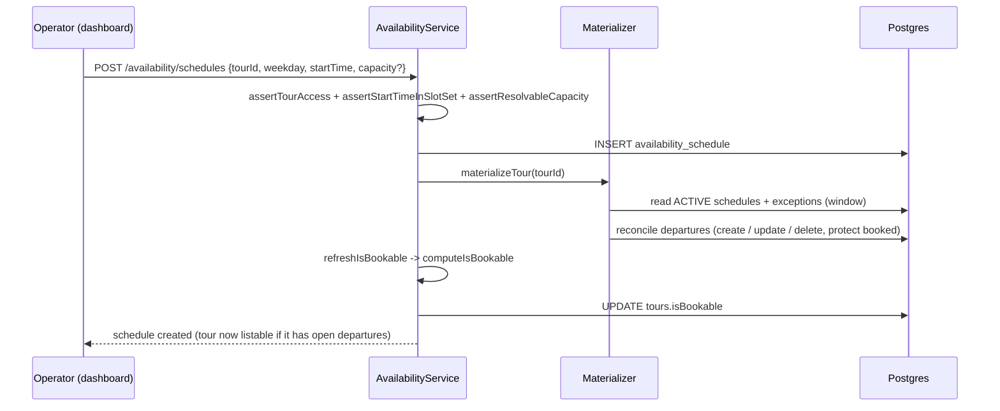
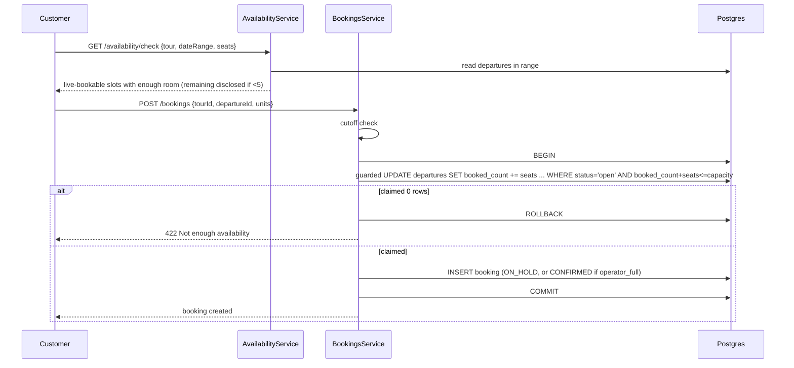

# Availability & Booking Architecture

> **Scope.** This is the comprehensive engineering reference for how a tour goes
> from an operator authoring availability rules to a customer completing a
> booking, and how a tour becomes (or stops being) visible in public listings.
> It documents the real, shipped code - every non-obvious claim is anchored to a
> `file:line`.
>
> **Companion doc.** For the short, operational "why is my tour not listed and
> how do I fix it" playbook, see
> [`../03-implementation/AVAILABILITY-ISBOOKABLE-FLOW.md`](../03-implementation/AVAILABILITY-ISBOOKABLE-FLOW.md).
> This document is the deeper architectural treatment.

---

## Table of contents

1. [Overview](#1-overview)
2. [Design goals & principles](#2-design-goals--principles)
3. [Core concepts (the entities)](#3-core-concepts-the-entities)
4. [The write side: rules become inventory](#4-the-write-side-rules-become-inventory)
5. [The materializer in depth](#5-the-materializer-in-depth)
6. [The read side: live availability](#6-the-read-side-live-availability)
7. [The booking lifecycle](#7-the-booking-lifecycle)
8. [The listing gate (`isBookable`)](#8-the-listing-gate-isbookable)
9. [Nightly jobs](#9-nightly-jobs)
10. [When everything recomputes (the trigger matrix)](#10-when-everything-recomputes-the-trigger-matrix)
11. [State machines](#11-state-machines)
12. [End-to-end sequence diagrams](#12-end-to-end-sequence-diagrams)
13. [Real-world scenarios](#13-real-world-scenarios)
14. [The dashboard surface](#14-the-dashboard-surface)
15. [Responsibilities: every table & service](#15-responsibilities-every-table--service)
16. [Invariants & design rationale](#16-invariants--design-rationale)
17. [File index](#17-file-index)

---

## 1. Overview

The availability system is an **inventory engine**, structured like an airline
seat or hotel room inventory: recurring business rules and one-off overrides are
projected into concrete, sellable units, and bookings claim those units
atomically.

The whole system is one directional pipeline:

```
Operator                                            Customer
   │                                                   │
   ▼                                                   ▼
Schedule ─┐                                       Availability API
          ├─▶ Materializer ─▶ Departure ─────────▶ (reads departures)
Exception ┘                      │                     │
                                 │                      ▼
                                 └───▶ Booking ── claims seats (atomic)
                                          │
                                          ▼
                                   computeIsBookable ─▶ Tour.isBookable ─▶ Public listing
```

- **Schedules** and **Exceptions** are the operator-authored *rules*. Nothing is
  ever booked against them directly.
- The **Materializer** projects those rules into **Departures** - the concrete,
  per-date-and-time sellable units. Departures are the single source of truth for
  inventory.
- **Bookings** claim seats on a departure with a single guarded, atomic SQL
  statement (the overbooking backstop).
- **`Tour.isBookable`** is a cached boolean derived from the departures. The
  public catalog filters on it so it never has to join departures per request.

This is a **CQRS-style read/write split**:

| Side | Path |
|---|---|
| **Write** | Operator -> Schedule / Exception -> Materializer -> Departure |
| **Read** | Customer -> Departure -> live status -> Availability API / listing gate |

Keeping the two sides separate is what makes the system predictable, keeps
overbooking impossible, and leaves room to plug in external inventory providers
(OCTO) later.

---

## 2. Design goals & principles

1. **Departures are the single source of truth.** Everything sellable is a
   `Departure` row. Schedules and exceptions only *describe* what departures
   should exist. This is why the dashboard exposes schedules and exceptions but
   **not** departure editing - editing derived data would let the truth drift
   from its source.

2. **Idempotent projection.** Running the materializer again for the same window
   converges to the same departures. It is keyed on `(tourId, date, startTime)`
   and reconciles create / update / delete against what already exists.

3. **Protected inventory is never overwritten.** A departure that has bookings,
   was manually edited, or came from an external API is *protected* - the
   materializer will not touch it even if the rules change.

4. **Transient states are computed at read time, never stored.** The booking
   cutoff and the customer-facing status are derived live from the clock. The
   database is not mutated as time passes.

5. **Overbooking is structurally impossible.** A booking claims seats with one
   atomic conditional `UPDATE`; if the guard fails the whole transaction rolls
   back.

6. **The listing gate is a cache.** `isBookable` is denormalized onto the tour so
   the public grid is a single indexed filter, not a per-request availability
   computation across the catalog.

7. **All times are destination-local.** "Now" always means the island's
   wall-clock now (`localNow(timeZone)`), so cutoffs and horizons behave the way
   an operator on the island expects.

---

## 3. Core concepts (the entities)

Schema lives in `backend/prisma/availability.prisma`; the two governing fields on
the tour live in `backend/prisma/tours.prisma`.

### 3.1 Tour (static configuration)

The tour carries the configuration the whole engine reads but the availability
domain never mutates:

| Field | Role |
|---|---|
| `timeZone` | Destination-local clock for every date/time computation |
| `startTimes[]` | The allowed slot set; a schedule's `startTime` must be one of these |
| `maxPartySize` | **Default departure capacity** when a schedule has no override |
| `bookingCutoffMinutes` | How long before departure sales close (applied live) |
| `isBookable` | **Cached** listing gate (system-managed, never client-written) |
| `paymentModel` | Drives whether a booking is held or immediately confirmed |

### 3.2 AvailabilitySchedule (recurring rule) - `availability.prisma:6-26`

One row per `tour x weekday x startTime`. The recurring weekly pattern.

| Field | Meaning |
|---|---|
| `weekday` | **0 = Monday ... 6 = Sunday** (tour-local). NOT JavaScript's Sunday = 0. |
| `startTime` | `@db.Time`; must be in `Tour.startTimes[]` |
| `capacityOverride` | `Int?` - `null` falls back to `Tour.maxPartySize` |
| `validFrom` / `validUntil` | Window the rule applies (`validUntil` null = open-ended) |
| `status` | `ACTIVE` (default) or `PAUSED`; only `ACTIVE` rules materialize |

Unique on `(tourId, weekday, startTime, validFrom)`.

### 3.3 AvailabilityException (one-off override) - `availability.prisma:30-49`

A date-specific deviation from the weekly pattern. Four types
(`enums.prisma`, `AvailabilityExceptionType`):

| Type | Effect |
|---|---|
| `CLOSE_DATE` | Stop-sell the whole date (departures kept, marked `CLOSED`) |
| `CLOSE_SLOT` | Stop-sell one start time on a date |
| `ADD_SLOT` | Introduce a departure the weekly pattern does not produce |
| `SET_CAPACITY` | Override capacity for one slot (`startTime` set) or the whole date (`startTime` null) |

### 3.4 Departure (materialized inventory) - `availability.prisma:52-78`

The concrete, sellable unit. One per `tour x date x startTime`.

| Field | Meaning |
|---|---|
| `date` + `startTime` | The concrete local instant |
| `capacity` | Resolved seats for this departure |
| `bookedCount` | Seats claimed; `>= capacity` means full |
| `status` | `OPEN` / `SOLD_OUT` / `CLOSED` / `CANCELLED` |
| `soldOutAt` | Stamped once when it fills (feeds demand signals) |
| `source` | `SCHEDULE` / `EXCEPTION` / `API` |
| `manuallyEdited` | `true` protects it from re-materialization |

Unique on `(tourId, date, startTime)` - the idempotency key the materializer
reconciles against.

### 3.5 Booking - claims a departure

A booking references one `departureId` and holds a count of unit items (seats).
It never touches schedules; it claims seats on the departure. Booking status:
`ON_HOLD`, `CONFIRMED`, `CANCELLED`, `EXPIRED` (`bookings.service.ts`).

### 3.6 Derived / computed logic (`availability-status.util.ts`)

Not tables - pure functions that define the read semantics:

- `storedStatusForFill(capacity, bookedCount)` - the status to *persist* from fill
  alone: full -> `SOLD_OUT`, else `OPEN` (`:18-25`).
- `liveDepartureStatus({...})` - the *customer-facing* status computed at read
  time (`:41-52`).
- `isDepartureBookable(live)` - only a live `OPEN` departure is bookable (`:55-57`).
- `discloseRemaining(remaining)` - whether to show "Only N left" (`:60-62`).
- `BOOKABLE_HORIZON_DAYS = 30`, `REMAINING_DISCLOSURE_THRESHOLD = 5` (`:4`, `:11`).

---

## 4. The write side: rules become inventory

### 4.1 Step 1 - the operator creates a tour

At creation the tour has configuration but **no availability**. There are no
schedules, so the materializer produces no departures, so nothing is bookable:

```
Tour (LIVE)  ─▶  no Schedule  ─▶  no Departure  ─▶  cannot book, not listed
```

Example configuration:

```
Island Hopping Tour   timeZone: America/Curacao   maxPartySize: 12
bookingCutoffMinutes: 120   startTimes: [09:00, 13:00, 16:00]
```

### 4.2 Step 2 - the operator authors weekly schedules

```
Monday    09:00   capacity: default (uses maxPartySize = 12)
Wednesday 13:00   capacity: 20 (override)
```

These become `AvailabilitySchedule` rows. **Still nothing is bookable** - bookings
never come from schedules.

`AvailabilityService.createSchedule` (`availability.service.ts:88`) runs three
guards before inserting, then materializes synchronously:

1. `assertTourAccess` - ownership.
2. `assertStartTimeInSlotSet` - the time must be a declared `startTime`.
3. `assertResolvableCapacity` - **the override, or the tour's `maxPartySize`, must
   resolve to a real number.** Without either, the materializer would silently
   skip the slot (see [§16](#16-invariants--design-rationale)), so the write is
   rejected up-front with an actionable message.

Then `syncTourAvailability` (`:155-158`) = `materializeTour` + `refreshIsBookable`.

### 4.3 Step 3 - the materializer projects departures

On today = 1 Jul, the default window is today + 90 days. The Monday rule projects
a departure for every in-window Monday:

```
Departure  7 Jul 09:00  cap 12  OPEN  source SCHEDULE
Departure 14 Jul 09:00  cap 12  OPEN  source SCHEDULE
Departure 21 Jul 09:00  cap 12  OPEN  source SCHEDULE
...
Departure  9 Jul 13:00  cap 20  OPEN  source SCHEDULE   (Wednesday rule)
```

Now the `Departure` table is the inventory, and the tour can be booked.

### 4.4 Step 4 - exceptions layer on top

Exceptions are edits on specific dates, applied *after* the schedule projection
for that day. Examples:

- **Holiday closure** - `CLOSE_DATE` on 25 Dec -> after re-materialization every
  25 Dec departure is `CLOSED` (not deleted - stop-sell).
- **Extra departure** - `ADD_SLOT` 25 Dec 15:00 -> a new departure appears at
  15:00 alongside the pattern's 09:00.
- **Capacity change** - `SET_CAPACITY` 25 Dec 09:00 -> 25 -> that departure's
  capacity becomes 25.

Any exception create/delete re-runs `materializeTour` + `refreshIsBookable`, so
the departures reflect the override immediately.

---

## 5. The materializer in depth

File: `backend/src/availability/availability-materializer.service.ts`. Entry
point `materializeTour(tourId, from?, to?)` (`:51`).

### 5.1 Window resolution (`:102-123`)

- Default window: `today ... today + 90` days (`DEFAULT_HORIZON_DAYS = 90`, `:24`).
- Hard cap: 365 days (`MAX_HORIZON_DAYS = 23`). The nightly job passes
  `to = today + 364d`.
- `to < from` or a window over the cap throws.

### 5.2 Building the desired set (`buildDayDepartures`, `:126-218`)

For each calendar day in the window, in order:

1. **Schedule slots.** For each `ACTIVE` schedule whose `weekday` matches and
   whose `validFrom/validUntil` covers the day, add a desired departure. Capacity
   resolves as `schedule.capacityOverride ?? tour.maxPartySize`. **If that is
   `null`, the slot is skipped with only a warning log** (`:143-149`) - the
   silent-skip failure mode the capacity guard now prevents at write time.
2. **`ADD_SLOT` exceptions** (`:161-184`) - add extra departures.
3. **`SET_CAPACITY` exceptions** (`:187-201`) - override capacity for one slot or
   the whole day.
4. **`CLOSE_DATE` / `CLOSE_SLOT`** (`:204-217`) - mark desired departures `CLOSED`
   (kept, not removed).

Full capacity precedence: `exception.capacity ?? schedule.capacityOverride ??
tour.maxPartySize`.

### 5.3 Reconcile (`:221-324`)

The desired set is reconciled against existing departures in the window:

- **Create** desired departures that do not exist (`:262-273`).
- **Update** capacity/status on existing *unprotected* rows (`:278-290`).
- **Delete** orphans - existing rows no longer desired *and* unprotected (`:292-302`).

A row is **protected** and never modified when
`bookedCount > 0 || manuallyEdited || source === API` (`:246-253`). All writes run
in one `$transaction` (`:311`). The method returns
`{ created, updated, skipped, removed }` and logs
`Materialized tour <id>: +2 ~1 skip 0 -0` (`:319-322`).

> **Why "skip" exists.** A booked departure is real inventory a customer holds.
> If the operator later changes a schedule, the materializer must not silently
> delete or resize a departure someone already booked - so it skips it.

---

## 6. The read side: live availability

The write side stores departures. The read side interprets them for the moment of
the request, without mutating anything.

### 6.1 Live status (`liveDepartureStatus`, `availability-status.util.ts:41-52`)

Given a departure and "now", the customer-facing status is:

```
if status == CANCELLED        -> CANCELLED   (sticky operator/admin state)
if status == CLOSED           -> CLOSED      (sticky)
if bookedCount >= capacity    -> SOLD_OUT
if now >= start - cutoffMins  -> CLOSED      (cutoff passed; NEVER stored)
otherwise                     -> OPEN
```

So a departure stored as `OPEN` can *read* as `CLOSED` once its booking cutoff
passes - the database is not touched, the cutoff is applied on the fly. Only a
live `OPEN` counts as bookable (`isDepartureBookable`).

**Example.** Departure at 09:00, cutoff 120 min. At 08:15 there are 45 minutes
left - past the 120-minute cutoff. Stored status is still `OPEN`; the API returns
`CLOSED`.

### 6.2 The anti-scarcity disclosure rule (`discloseRemaining`, `:60-62`)

`remaining = capacity - bookedCount`. The traveler is shown "Only N left" **only
when `0 < remaining < 5`**. At or above 5 the remaining count is hidden (the API
returns `remaining: null`) - the customer just sees "Available". This is a
deliberate ethical-CRO decision to avoid manufactured scarcity.

| capacity | booked | remaining | shown to customer |
|---|---|---|---|
| 12 | 4 | 8 | "Available" (count hidden) |
| 12 | 10 | 2 | "Only 2 left" |
| 12 | 12 | 0 | "Sold out" |

### 6.3 Public read endpoints (`availability.service.ts`)

- `checkAvailability(dto)` (`:443-468`) - given a date range and requested seat
  count, returns the live-bookable slots that still have enough room
  (`d.available && capacity - bookedCount >= requiredSeats`). If a customer wants
  4 seats and 3 remain, that slot is filtered out.
- `calendar(dto)` (`:470-496`) - per-day aggregate for the date picker (open /
  sold-out / closed per day, best disclosed remaining).

Both read the departures table directly and map through `liveDepartureStatus`;
neither uses the cached `isBookable` flag (that flag is for the catalog grid).

---

## 7. The booking lifecycle

File: `backend/src/bookings/bookings.service.ts`. Bookings are the only writer of
`departure.bookedCount`, and they do it safely.

### 7.1 Pre-claim checks (`loadContext` / `reserve`)

Before claiming, the service validates the departure belongs to the tour
(`loadContext`) and that the **booking cutoff has not passed** (`cutoffReached`) -
the same live cutoff the read side applies, enforced here as a hard guard.
Since hardening F9, reserve also SHEDS certain doom (departure not open, or
zero seats free) before pricing/FX - advisory only; the claim below stays the
authority. Anchors in this section are SYMBOLS, not line numbers - the doc's
own rule: line anchors drift, symbols survive.

### 7.2 The atomic guarded claim (the overbooking backstop, `claimSeats`)

Inside a transaction, a single conditional `UPDATE` claims the seats:

```sql
UPDATE departures
   SET booked_count = booked_count + :seats,
       status = CASE WHEN booked_count + :seats >= capacity
                     THEN 'sold_out' ELSE status END,
       sold_out_at = CASE WHEN booked_count + :seats >= capacity AND sold_out_at IS NULL
                          THEN now() ELSE sold_out_at END,
       updated_at = now()
 WHERE id = :departureId
   AND tour_id = :tourId
   AND status = 'open'
   AND booked_count + :seats <= capacity;
```

If this affects **0 rows** (someone else took the last seats, the departure
closed, or the cutoff logic changed the state) the service throws
`Not enough availability for this departure` and the transaction rolls back. Because the guard (`booked_count + seats <= capacity`) and the
increment happen in the same statement, **two concurrent bookings can never both
succeed past capacity** - the database serializes them.

When the claim fills the departure, the same statement flips it to `SOLD_OUT` and
stamps `soldOutAt`.

As built (hardening F1-F3, 2026-08-10) this SQL is LITERAL - one raw guarded
UPDATE in `claimSeats()`, shared by reserve, pay-after-expiry recovery,
restore (an `intoSticky` mode accepts SOLD_OUT/CLOSED for returning seats;
only CANCELLED refuses) and date-change. In the reserve transaction the claim
runs LAST, after the booking insert, so the hot row's lock spans ~one
statement + commit (F3). A DB CHECK constraint
(`departures_booked_within_capacity`, F5) backstops the invariant against any
future writer.

### 7.3 Hold vs immediate confirm (`reserve`)

The new booking's status depends on the tour's `paymentModel`:

- `OPERATOR_FULL` -> created **`CONFIRMED`** immediately (no payment is taken on
  platform, so there is nothing to wait for).
- All other models -> created **`ON_HOLD`**; the seats are already claimed, and
  confirmation follows payment.

### 7.4 Release paths (cancel / expiry)

Seats are returned via `releaseSeats` (atomic since hardening F1 - the
previous read-modify-write lost decrements when the sweeper raced a cancel):

```sql
UPDATE departures SET booked_count = GREATEST(booked_count - :seats, 0) WHERE id = :id;
```

then `recomputeStoredStatus` re-derives `OPEN`/`SOLD_OUT` from the
new fill via `storedStatusForFill`, **leaving sticky `CLOSED`/`CANCELLED`
untouched**. So a `SOLD_OUT` departure that gets a cancellation reopens to `OPEN`.

Two triggers:

- **Cancellation** (`cancel`) - releases the seats and marks the booking /
  its unit items `CANCELLED`.
- **Hold expiry** (`expireStaleHolds`, a BullMQ scheduler tick every minute
  since F8 - single-runner across replicas) - finds `ON_HOLD` bookings past
  `utcExpiresAt`, flips each through a GUARDED `ON_HOLD -> EXPIRED` updateMany
  FIRST (overlapping ticks must not double-release), then releases seats.

### 7.5 A subtlety: bookings do not refresh `isBookable`

The booking service does **not** call `refreshIsBookable`. So if the last open
departure in the 30-day window sells out, the tour's cached `isBookable` stays
`true` until the next availability mutation or the nightly recompute. This is an
accepted staleness window (the departure itself is correctly `SOLD_OUT`, so it
cannot be overbooked; the tour just lingers in listings slightly longer). See
[§8](#8-the-listing-gate-isbookable) and [§16](#16-invariants--design-rationale).

---

## 8. The listing gate (`isBookable`)

### 8.1 What it means

`computeIsBookable(tourId)` (`availability.service.ts:502-536`) returns `true`
iff the tour has **at least one live-`OPEN` departure within the next 30 days**
(`BOOKABLE_HORIZON_DAYS`). It queries `OPEN` departures in
`[today, today + 30d]`, then keeps only those still `OPEN` after the live cutoff
check.

`refreshIsBookable(tourId)` (`:544-551`) runs that computation and **persists** the
result to `tour.isBookable`. It is the only writer of the flag.

### 8.2 How the public catalog uses it

`ToursService.findAll` filters the grid on the cached flag - no per-request
departures join:

```ts
where = { status: TourStatus.LIVE, isActive: true, isBookable: true };
```

The dashboard "PUBLISHED, NOT YET LISTED" banner is the inverse:
`status === LIVE && isBookable === false`.

### 8.3 Why it is a cache

A marketplace grid renders many tours per page. Computing "does each tour have an
open departure in 30 days" per request, across the catalog, would be a large
repeated join. Denormalizing the answer onto the tour makes the grid a single
indexed boolean filter. The cost is that the flag must be refreshed on every event
that could change it - see the trigger matrix.

---

## 9. Nightly jobs

File: `backend/src/workers/nightly-jobs.service.ts`. A `@nestjs/schedule` cron at
**03:00 UTC** (`:35-38`) - an in-process idempotent recompute, **not** BullMQ
(these are recomputes, not a retry/concurrency queue).

`run()` (`:44-65`) does, in order:

1. Spotlight lifecycle + demand signal (commercial concerns, out of scope here).
2. `availability.materializeAllLive()` (`availability.service.ts:583-605`) -
   re-projects a rolling ~12 months for every LIVE + active tour; per-tour
   failures are logged and skipped so one bad tour never aborts the batch.
3. `availability.recomputeAllBookable()` (`:558-574`) - refreshes `isBookable`
   for every LIVE + active tour.

Materialize runs **before** the bookability recompute so the flag reflects freshly
projected departures. This is also the job that eventually corrects the
`isBookable` staleness from [§7.5](#7-the-booking-lifecycle) and rolls the
materialization window forward each day.

---

## 10. When everything recomputes (the trigger matrix)

`isBookable` is a cache; it is only correct because it is refreshed on every event
that can change it. Materialization is likewise re-run on every rule change.

| Trigger | Code | What runs |
|---|---|---|
| Create schedule | `availability.service.ts:88-124` | materialize + refresh |
| Update schedule | `:160-205` | materialize + refresh |
| Delete schedule | `:207-227` | materialize + refresh |
| Create / delete exception | `:246-323` | (notifies; departures re-projected on next sync) |
| Manual `materialize` endpoint | `:350-364` | materialize(window) + refresh |
| Edit a departure (admin) | `:397-437` | refresh |
| **Tour published** | `tours.service.ts` publish | `computeIsBookable` stored at publish |
| **Tour unpaused** | `tours.service.ts` unpause | `computeIsBookable` stored |
| **`maxPartySize` changed** | `tours.service.ts` update | `resyncTourAvailability` (materialize + refresh) |
| **Nightly 03:00 UTC** | `workers/nightly-jobs.service.ts` | `materializeAllLive` -> `recomputeAllBookable` |
| Booking claim / release | `bookings.service.ts` | departure `bookedCount`/status only - **not** `isBookable` (nightly corrects) |

> The `maxPartySize` self-heal is the fix that lets a tour whose schedules were
> silently skipped for lack of capacity become bookable the moment a Max Party
> Size is set, without waiting for the nightly job.

---

## 11. State machines

### 11.1 Departure status

```
                 book fills it
   ┌────────┐  ───────────────▶  ┌──────────┐
   │  OPEN  │                     │ SOLD_OUT │
   └────────┘  ◀───────────────  └──────────┘
      │  ▲       cancel frees a seat
      │  │
      │  │ reopen (materialize / admin)
      ▼  │
   ┌────────┐        CLOSE_SLOT / CLOSE_DATE exception, or admin close
   │ CLOSED │  ◀──────────────────────────────────────────────────────
   └────────┘
                admin cancel
   ┌───────────┐
   │ CANCELLED │   (sticky - materializer + release leave it untouched)
   └───────────┘
```

- `OPEN <-> SOLD_OUT` is driven purely by fill (`storedStatusForFill`).
- `CLOSED` comes from stop-sell exceptions or an admin edit; it is sticky - the
  materializer keeps it and `recomputeStoredStatus` will not silently reopen it.
- `CANCELLED` is a terminal admin state.
- The **live** read layer adds a transient `CLOSED` when the cutoff has passed,
  without persisting it.

### 11.2 Booking status

```
                         payment / operator_full
   (create) ─▶ ON_HOLD ───────────────────────▶ CONFIRMED
                  │                                  │
     hold expiry  │                                  │ cancel
                  ▼                                  ▼
               EXPIRED                           CANCELLED
   (OPERATOR_FULL tours are created CONFIRMED directly, skipping ON_HOLD)
```

`ON_HOLD` and `CONFIRMED` both hold seats. `EXPIRED` and `CANCELLED` both release
them.

---

## 12. End-to-end sequence diagrams

### 12.1 Operator authors availability



### 12.2 Customer books



### 12.3 The full journey (compact)

```
Operator
   │  creates tour (config only)
   ▼
Defines weekly schedule ───────────────┐
   │                                    │
Adds holiday / extra slot / capacity ───┤  (exceptions)
   │                                    │
   ▼                                    ▼
Materializer  ── creates / updates / closes / removes departures (protects booked)
   │
   ▼
Departure table  (single source of truth for inventory)
   │
   ▼
Availability API  ── live status (cutoff, sold-out) + anti-scarcity disclosure
   │
   ▼
Customer booking ── atomic guarded claim ── bookedCount++ ── OPEN / SOLD_OUT
   │
   ▼
computeIsBookable ── Tour.isBookable ── Search / Listing
   ▲
   └── Nightly job: materializeAllLive -> recomputeAllBookable
```

---

## 13. Real-world scenarios

| Scenario | Operator action | System result |
|---|---|---|
| **Weekly recurring tour** | Add Monday 09:00 schedule | Departures for every Monday in the window, `OPEN` at the tour's default capacity |
| **Public holiday** | `CLOSE_DATE` on 25 Dec | Every 25 Dec departure becomes `CLOSED` (kept, not deleted); if it was the only near-term availability, `isBookable` may flip off |
| **Extra festival departure** | `ADD_SLOT` 25 Dec 15:00 (+ capacity if no `maxPartySize`) | A new 15:00 departure is created alongside the pattern's slots |
| **Bigger boat one day** | `SET_CAPACITY` 25 Dec 09:00 -> 25 | That departure's capacity becomes 25; already-booked seats preserved |
| **Boat maintenance tomorrow** | `CLOSE_SLOT` tomorrow 09:00 | Just that slot is stop-sold; other times that day stay open |
| **Captain sick, whole day off** | `CLOSE_DATE` today | All of today's departures `CLOSED` |
| **Last seats sell** | (customer books) | Guarded claim flips the departure to `SOLD_OUT`, stamps `soldOutAt`; tour de-lists at the next recompute |
| **Booking cancelled** | (customer / ops cancels) | `releaseSeats` decrements and reopens a `SOLD_OUT` departure to `OPEN` |
| **No capacity anywhere** | schedule with no override on a tour with no `maxPartySize` | **Rejected at write time** by `assertResolvableCapacity` (previously: silent skip -> "published, not listed") |

The dashboard covers all of the "operator action" rows via **Schedules** and
**Exceptions** - roughly 95% of operational needs - without ever exposing raw
departure editing.

---

## 14. The dashboard surface

What operators can and cannot touch, and why:

| Layer | Dashboard | Rationale |
|---|---|---|
| **Schedules** | Full CRUD (Schedules tab, `trip-schedules-tab.tsx`) | The primary interface: weekly rules, per-rule capacity, valid window, pause |
| **Exceptions** | Full CRUD (same tab, `ExceptionsSection`) | The daily operational tool: close a day/slot, add a slot, change capacity. For CLOSE_SLOT / SET_CAPACITY the start time is a **date-aware dropdown of the actually-scheduled slots**; ADD_SLOT is a free time (it introduces a new one) |
| **Departures** | **Not exposed** | Derived inventory. Editing it would break the source of truth. Emergency departure overrides remain a backend-only capability a future admin-only "Inventory" view could gate behind a permission |

This mapping is a direct consequence of principle #1: the dashboard edits *rules*
(schedules, exceptions); the system owns the *inventory* (departures). Nearly every
real emergency (broken boat, sick captain, holiday) is expressible as an exception,
so operators are never forced to touch derived data.

---

## 15. Responsibilities: every table & service

### 15.1 Tables

| Table | Responsibility |
|---|---|
| `tours` | Static config: timezone, start times, default capacity, booking cutoff, cached `isBookable` |
| `availability_schedules` | Recurring weekly business rules |
| `availability_exceptions` | One-off date overrides (holiday, extra slot, capacity, stop-sell) |
| `departures` | The single source of truth for sellable inventory |
| `bookings` | Claims seats on a departure; owns the sell-through lifecycle |

### 15.2 Services & utilities

| Unit | Responsibility |
|---|---|
| `AvailabilityService` | Schedule/exception/departure CRUD, public reads, `computeIsBookable`/`refreshIsBookable`, the batch recomputes, and the write-time guards (`assertResolvableCapacity`) |
| `AvailabilityMaterializerService` | Project schedules + exceptions into departures for a window; reconcile idempotently while protecting booked/manual/API rows |
| `availability-status.util.ts` | Pure read semantics: live status, bookability, fill-derived stored status, anti-scarcity disclosure, the horizon/threshold constants |
| `BookingsService` | Atomic guarded seat claim, hold/confirm by payment model, release on cancel/expiry, stored-status recompute |
| `NightlyJobsService` | Roll the materialization window forward and refresh `isBookable` across all live tours nightly |

---

## 16. Invariants & design rationale

These are the rules you must not break when changing this code.

1. **`isBookable` is a cache.** Any new code path that can change a tour's
   departures (or their bookability) must call `refreshIsBookable` /
   `resyncTourAvailability` afterwards, or rely on the nightly recompute. The one
   deliberate exception is the booking claim (see #7), where the small staleness
   is acceptable and the nightly job corrects it.

2. **Never materialize without a resolvable capacity.** A schedule with no
   `capacityOverride` on a tour with no `maxPartySize` produces `null` capacity,
   which the materializer silently skips - the historical root cause of
   "published but not listed". The `assertResolvableCapacity` guard blocks this at
   write time; keep it.

3. **Protected departures are sacred.** The reconciler must never overwrite or
   delete a row with `bookedCount > 0`, `manuallyEdited`, or `source === API`.
   This is what lets operators safely edit rules without harming existing
   bookings.

4. **Weekday is Monday = 0** everywhere - backend, materializer, frontend. Do not
   reintroduce JavaScript's Sunday = 0.

5. **The cutoff is live, never stored.** Do not materialize the cutoff into a
   departure status; it is applied in `liveDepartureStatus` at read time.

6. **The overbooking backstop is the single guarded `UPDATE`.** Do not split the
   capacity check and the increment into separate statements - the atomicity is
   the entire point.

7. **The public grid reads `isBookable`, not departures.** Keep it that way; the
   cache exists precisely to avoid a per-request catalog-wide join.

**Why this architecture wins:**

- **Separation of concerns** - recurring rules, one-off overrides, inventory, and
  public visibility are four distinct layers with one responsibility each.
- **Single source of truth** - everything sellable is a departure; there is never
  ambiguity about "what can be booked".
- **Idempotency** - re-running the materializer is always safe and convergent.
- **Performance** - the hot read path (catalog grid) is one indexed boolean.
- **Scalability & race-safety** - concurrent bookings are serialized by the
  database at the row level.
- **Extensibility** - because departures are the interface, an external inventory
  provider (OCTO) or an API-sourced departure (`source = API`, protected from the
  materializer) slots in without disturbing the schedule/exception model.

---

## 17. File index

| Concern | File |
|---|---|
| Schedule/exception/departure CRUD, reads, listing gate, guards | `backend/src/availability/availability.service.ts` |
| Rule -> departure projection engine | `backend/src/availability/availability-materializer.service.ts` |
| Live status, bookability, disclosure, horizon/threshold constants | `backend/src/availability/availability-status.util.ts` |
| Availability DTOs | `backend/src/availability/dto/availability.dto.ts` |
| Availability routes | `backend/src/availability/availability.controller.ts` |
| Booking claim / release / lifecycle | `backend/src/bookings/bookings.service.ts` |
| Publish / unpause / `maxPartySize` self-heal | `backend/src/tours/tours.service.ts` |
| Public catalog filter (`isBookable`) | `backend/src/tours/tours.service.ts` (`findAll`) |
| Nightly cron | `backend/src/workers/nightly-jobs.service.ts` |
| Availability schema | `backend/prisma/availability.prisma` |
| Enums (`DepartureStatus`, `AvailabilityExceptionType`, `BookingStatus`) | `backend/prisma/enums.prisma` |
| Schedules + Exceptions dashboard UI | `frontend/components/dashboard/trips/trip-schedules-tab.tsx` |
| "Not yet listed" banner | `frontend/components/dashboard/trips/trip-edit-view.tsx` |
| Short operational playbook | `technical-doc/03-implementation/AVAILABILITY-ISBOOKABLE-FLOW.md` |
</content>
