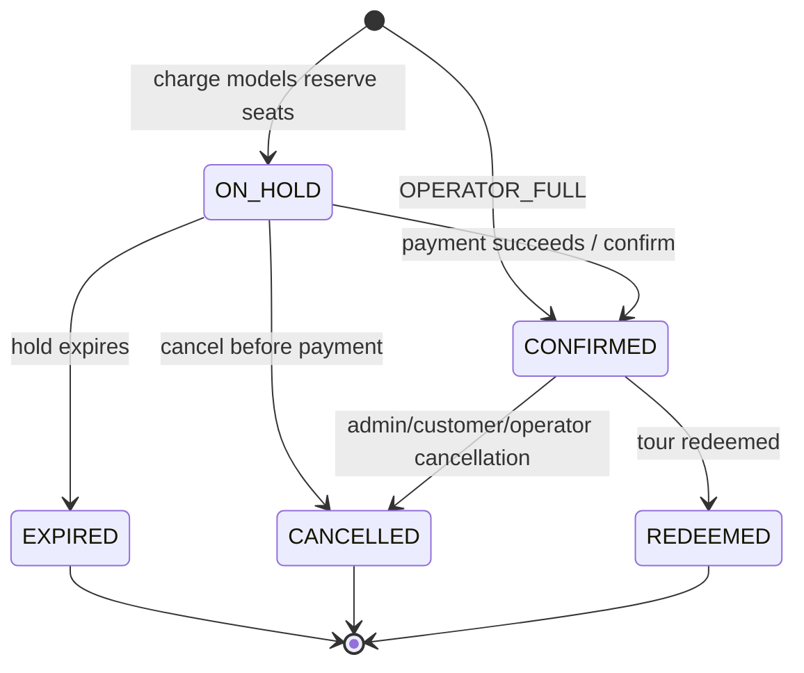
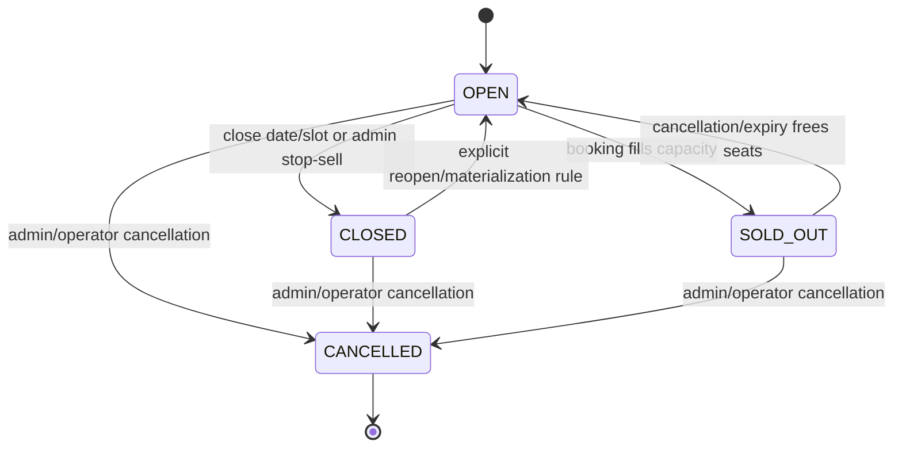
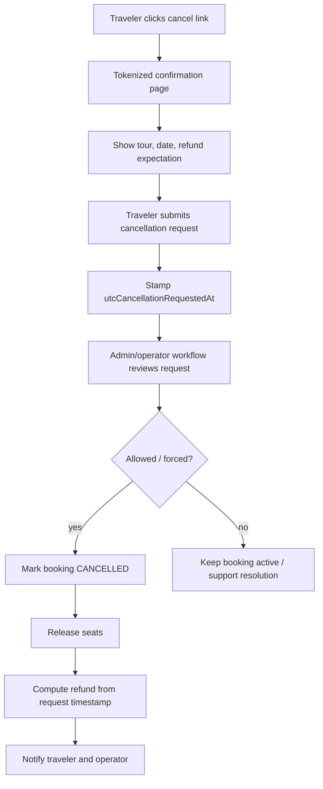

# Booking Flow Design Guide

> Canonical source: `technical-doc/island-tours-platform-master.html` v1.9.
> This guide reconciles the master, booking/payment docs, availability docs, Prisma schema,
> and current backend API implementation. On any conflict, the master wins.

Companion references:
- `technical-doc/02-architecture/BOOKING-AND-PAYMENTS.md`
- `technical-doc/02-architecture/AVAILABILITY-BOOKING-ARCHITECTURE.md`
- `technical-doc/02-architecture/TRACKING-AND-ANALYTICS.md`
- `technical-doc/03-implementation/BOOKING-AND-PAYMENT-DATA.md`
- `backend/prisma/bookings.prisma`
- `backend/prisma/payments.prisma`
- `backend/prisma/availability.prisma`
- `backend/src/bookings/`
- `backend/src/payments/`

## 1. Locked Master Decisions

These decisions are locked for booking-module design:

- Booking is instant. There is no enquiry model and no 24-hour approval step.
- Inventory source of truth is `departures`, not schedules or exceptions.
- Capacity must be claimed with one guarded atomic database update.
- `payment_model` is snapshotted onto the booking at creation.
- Tier/commission snapshots are never retroactive.
- `commission_amount` in EUR is the conversion value. Never use GMV for tracking.
- TYP route is `/{destination}/thank-you/{public_ref}` with no locale prefix and `noindex`.
- `public_ref` is the unguessable TYP URL token. `display_ref` is customer-facing.
- One unified `cancellation_hours` window `[24, 48, 72, 168]`, default `48`, governs both free cancellation and balance deadline.
- Cancellation deadline is computed, never stored.
- `operator_link` balance is not tracked by Island Tours v1.
- Deposit forfeiture is never automatic. Operator reports non-payment, admin confirms, then deposit/spot outcome is applied.
- Webhooks must be `@Public()` + `@SkipThrottle()`, signature-verified, and idempotent.
- `operator_full` takes no payment rail and is created `CONFIRMED` at commit.

## 2. Payment Models

| Model | Charged at checkout | Balance handling | Payment rail | Created status |
|---|---:|---|---|---|
| `OPERATOR_LINK` | `depositPct`% deposit | Operator emails secure balance link | Stripe/Mollie | `ON_HOLD`, then `CONFIRMED` after payment |
| `ON_ARRIVAL` | `depositPct`% deposit | Balance paid in person | Stripe/Mollie | `ON_HOLD`, then `CONFIRMED` after payment |
| `PAID_IN_FULL` | 100% | Nothing later | Stripe/Mollie | `ON_HOLD`, then `CONFIRMED` after payment |
| `OPERATOR_FULL` | 0 | Operator collects full amount directly | none | `CONFIRMED` at commit |

Important implementation note: if code treats `ON_ARRIVAL` as no upfront charge, that conflicts with the master. `ON_ARRIVAL` is a deposit model.

## 3. Core Entities

### `Departure`

Concrete bookable inventory row. One row per tour, date, and start time.

Key fields:
- `tourId`
- `date`
- `startTime`
- `capacity`
- `bookedCount`
- `status`: `OPEN`, `SOLD_OUT`, `CLOSED`, `CANCELLED`
- `soldOutAt`
- `source`
- `manuallyEdited`

Bookings only claim `Departure` rows. They never book against schedules.

### `Booking`

The immutable commercial and traveler snapshot for a booking.

Critical fields:
- `publicRef`: TYP URL token
- `displayRef`: customer-facing reference
- `tourId`, `departureId`, `operatorId`, `userId`
- `status`
- `paymentModel`
- `currency`, `totalRetail`, `depositAmount`, `balanceAmount`
- `commissionRate`, `commissionAmount`, `totalEur`, `fxRateToEur`
- `localDate`, `startTime`, `tourStartDateTime`, `tourEndDateTime`, `tourTimeZone`
- `contactFirstName`, `contactLastName`, `contactEmail`, `contactPhone`
- `utm*`, `clickId`, `gbraid`, `wbraid`, `fbclid`, `affiliateId`
- `conversionFiredAt`
- cancellation fields

### `BookingUnitItem`

One row per traveler/ticket. All unit items count toward departure capacity, including infants and spectators.

### `BookingAddOn`

Snapshotted add-on line items. A later `TourAddOn` edit must not mutate an existing booking.

### `Payment`

Platform payment ledger row.

Kinds:
- `DEPOSIT`
- `FULL`
- `REFUND`
- `BALANCE` exists in enum, but v1 should not create operator-link balance rows because the operator collects that balance outside the platform.

## 4. End-to-End Booking Flow

1. Traveler opens tour detail page.
2. Frontend reads availability from the availability API, which projects live status from `departures`.
3. Traveler selects date, start time, party, add-ons, pickup, contact details, notes, and optional promo/attribution.
4. Frontend submits `POST /api/v1/bookings`.
5. Backend loads the tour, selected departure, age bands, add-ons, pickup, and effective commission.
6. Backend validates:
   - tour exists
   - departure exists and belongs to the tour
   - booking cutoff has not passed
   - party size is within min/max
   - age restrictions are met
   - selected age bands belong to the tour
   - add-ons are active and belong to the tour
   - pickup location belongs to the tour
7. Backend computes:
   - unit item totals
   - add-on totals
   - total retail
   - deposit amount
   - balance amount
   - commission rate
   - EUR-normalized commission when possible
8. Backend starts a database transaction.
9. Backend claims seats with a single guarded update on `departures`.
10. If the update affects zero rows, booking fails with an availability error.
11. Backend creates:
   - `Booking`
   - one `BookingUnitItem` per traveler
   - `BookingAddOn` snapshots
12. If `paymentModel = OPERATOR_FULL`, booking is created `CONFIRMED`, no payment intent is created, and confirmation finalization runs.
13. For charge models, booking is created `ON_HOLD` with `utcExpiresAt`.
14. Frontend requests `POST /api/v1/payments/bookings/:id/intent`.
15. Payment service creates or reuses a provider intent idempotently.
16. Traveler pays through Stripe/Mollie.
17. Provider webhook arrives.
18. Webhook verifies signature and records provider event idempotently.
19. On successful payment, payment row becomes `SUCCEEDED`.
20. Booking transitions `ON_HOLD -> CONFIRMED`.
21. Billing/card snapshot is written from provider payment method.
22. Confirmation finalization runs once:
   - EUR commission is backfilled if needed
   - `conversionFiredAt` is stamped
   - confirmation email is sent
   - Add invoice as attatchments (INVOICE RECIVE FROM STRIPE/MOLLIE)
   - server-side conversion side effects run
23. Traveler is redirected/rendered to TYP.
24. TYP returns conversion payload only for confirmed bookings with valid EUR commission.
25. Browser fires exactly one `booking_complete`.

## 5. Main Flow Diagram

```mermaid
flowchart TD
  A[Traveler selects date/time] --> B[Read live Departure availability]
  B --> C{Open, enough seats, before cutoff?}
  C -- no --> C1[Return to widget, keep date, choose another slot]
  C -- yes --> D[POST /api/v1/bookings]
  D --> E[Validate tour, departure, party, age, add-ons, pickup]
  E --> F[Compute total, deposit, balance, commission EUR]
  F --> G[DB transaction: guarded UPDATE departures booked_count]
  G --> H{Claim succeeded?}
  H -- no --> C1
  H -- yes --> I[Create Booking + UnitItems + AddOns snapshots]
  I --> J{paymentModel}
  J -- OPERATOR_FULL --> K[CONFIRMED at commit, no payment]
  J -- OPERATOR_LINK / ON_ARRIVAL / PAID_IN_FULL --> L[ON_HOLD + utcExpiresAt]
  L --> M[POST /payments/bookings/:id/intent]
  M --> N[Stripe/Mollie checkout]
  N --> O[Webhook: verify + idempotency ledger]
  O --> P[Payment succeeded]
  P --> Q[confirmFromPayment: CONFIRMED]
  K --> R[finalizeConfirmation once]
  Q --> R
  R --> S[Set EUR commission, conversionFiredAt, email, CAPI]
  S --> T[Render /{destination}/thank-you/{public_ref}]
  T --> U[Browser booking_complete once]
```

## 6. Booking State Machine



Rules:
- `ON_HOLD` and `CONFIRMED` hold seats.
- `EXPIRED` and `CANCELLED` release seats.
- `REDEEMED` is terminal for normal customer cancellation.
- `PENDING` and `REJECTED` exist in the enum for compatibility, but the instant-booking path should not depend on an enquiry-style pending approval flow.

## 7. Departure State Machine



Rules:
- `OPEN <-> SOLD_OUT` is fill-derived.
- `CLOSED` and `CANCELLED` are sticky operational states.
- Cutoff-passed status is computed live and must not be persisted as `CLOSED`.

## 8. Atomic Capacity Claim

The booking path must use one guarded update:

```sql
UPDATE departures
   SET booked_count = booked_count + :seats,
       status = CASE WHEN booked_count + :seats >= capacity
                     THEN 'sold_out' ELSE status END,
       sold_out_at = CASE WHEN booked_count + :seats >= capacity
                           AND sold_out_at IS NULL
                          THEN now() ELSE sold_out_at END,
       updated_at = now()
 WHERE id = :departure_id
   AND tour_id = :tour_id
   AND status = 'open'
   AND booked_count + :seats <= capacity;
```

If affected rows is `0`, the booking must fail and the frontend should return the traveler to date/time selection with their chosen date preserved.

Never split capacity check and increment into separate queries.

## 9. Pricing and Commission Logic

### Currency anchor

The tour is the currency source of truth.

```prisma
Tour.defaultCurrency Currency @default(USD)
```

All tour-authored prices are stored in the tour's `defaultCurrency`:

- `Tour.basePrice`
- `Tour.priceFrom`
- `TourAgeBand.price`
- `TourAgeBand.priceOriginal`
- `TourAgeBand.priceNet`
- `TourAddOn.price`

There is no per-age-band or per-add-on currency field. A tour should be treated as single-currency.
If `defaultCurrency = USD`, every listed amount on that tour is USD. If `defaultCurrency = EUR`,
every listed amount on that tour is EUR.

Booking creation snapshots that currency into:

```prisma
Booking.currency
```

This maps to the master's `original_currency`: the currency charged/displayed to the traveler.

### Retail total

Retail total is:

```text
sum(age band price * quantity) + sum(add-on line totals) - discount
```

Add-on line totals:
- `PER_PERSON`: `unitPrice * addOnQuantity * partySize`
- `FLAT`: `unitPrice * addOnQuantity`

### Deposit and balance

```text
OPERATOR_LINK: deposit = total * depositPct; balance = total - deposit
ON_ARRIVAL: deposit = total * depositPct; balance = total - deposit
PAID_IN_FULL: deposit/payToday = total; balance = 0
OPERATOR_FULL: deposit/payToday = 0; balance = total
```

### Commission snapshot

```text
commissionRate = effectiveCommissionPercent / 100
commissionAmount = totalEur * commissionRate
```

The effective commission may be the active Destination Spotlight rate if applicable. Once written to the booking, it never changes.

### Tracking value

```text
booking_complete.booking_value = bookings.commissionAmount
booking_complete.booking_currency = EUR
```

Never use `totalRetail`, `totalEur`, or GMV as the conversion value.

### USD/EUR flow

Traveler-facing money stays in the tour/booking currency. Analytics and commission reporting normalize
to EUR.

For a USD tour:

1. Operator enters tour prices in USD.
2. Booking snapshots `currency = USD`.
3. `totalRetail`, `depositAmount`, `balanceAmount`, unit-item prices, and add-on prices are stored in USD.
4. Stripe/Mollie charge is created in USD.
5. At confirmation, backend uses the FX rate snapshotted from the provider-backed quote.
6. Backend stores `totalEur = totalRetail * fxRateToEur`.
7. Backend stores `commissionAmount = totalEur * commissionRate`.
8. TYP and email can display customer money in USD, while `booking_complete` sends EUR commission.

For a EUR tour:

1. Operator enters prices in EUR.
2. Booking snapshots `currency = EUR`.
3. `fxRateToEur = 1`.
4. `totalEur = totalRetail`.
5. `commissionAmount = totalRetail * commissionRate`.

The FX rate is snapshotted on the booking so historical commission and conversion values never drift
when exchange rates change later.

Current implementation detail: the pricing utility can compute EUR commission immediately for EUR
bookings. For USD bookings, confirmation finalization backfills `fxRateToEur`, `totalEur`, and
`commissionAmount` before conversion fires.

### Shopper-selected display/checkout currency

The frontend already has a visitor currency preference:

```text
NEXT_CURRENCY = EUR | USD
```

That preference is a shopper/display currency. It is not the same thing as `Tour.defaultCurrency`.

Use these terms consistently:

| Term | Meaning |
|---|---|
| `tourCurrency` | Currency operators entered prices in. Current source: `Tour.defaultCurrency`. |
| `shopperCurrency` | Currency the visitor selected in the frontend. Source: `NEXT_CURRENCY`, default per locale. |
| `booking.currency` | Currency actually snapshotted and charged for this booking. Should equal `shopperCurrency` once multi-currency checkout is implemented. |
| `fxRateToEur` | Rate from `booking.currency` to EUR, snapshotted for tracking/commission. |
| `sourceFxRate` | Rate used to convert tour-authored prices from `tourCurrency` to `shopperCurrency`. This also needs a booking snapshot if checkout currency differs from tour currency. |

#### Display rules

If a traveler selects EUR, all public prices must display as EUR:

- tour cards
- search results
- tour detail pricing
- booking widget totals
- checkout pay-today/balance rows
- TYP and confirmation email, if the booking was charged in EUR

If a traveler selects USD, those same surfaces display as USD.

Frontend must not simply replace the symbol. It must display a converted amount.

#### Server-side rule

The server must be authoritative for money conversion on any bookable or transactional surface.

Frontend can read the selected currency and pass it to APIs:

```text
GET /api/v1/tours?...&currency=EUR
GET /api/v1/tours/slug/:slug?...&currency=EUR
GET /api/v1/availability/check?...&currency=EUR
POST /api/v1/bookings { ..., currency: "EUR" }
```

The backend should return money values in a structured shape:

```json
{
  "priceFrom": {
    "amount": "73.60",
    "currency": "EUR",
    "sourceAmount": "80.00",
    "sourceCurrency": "USD",
    "fxRate": "0.920000"
  }
}
```

For checkout, create a server-side quote before payment:

```text
POST /api/v1/bookings/quote
```

Quote inputs:
- `tourId`
- `departureId`
- `items`
- `addOns`
- `pickupLocationId`
- `couponCode`
- `currency` (`shopperCurrency`)

Quote output:
- converted line items
- converted add-ons
- `totalRetail`
- `depositAmount`
- `balanceAmount`
- `currency`
- `tourCurrency`
- `sourceFxRate`
- `fxRateToEur`
- `expiresAt`

Booking creation should either:
- accept a `quoteId` and revalidate it, or
- recompute the same quote server-side inside `POST /bookings`.

Do not trust frontend-converted totals.

#### Booking snapshot for shopper currency

When `shopperCurrency` differs from `tourCurrency`, the booking needs enough fields to audit both
the charged amount and the source tour amount:

```text
booking.currency                = shopperCurrency (charged/displayed currency)
booking.totalRetail             = converted total in shopperCurrency
booking.depositAmount           = converted deposit in shopperCurrency
booking.balanceAmount           = converted balance in shopperCurrency
booking.totalEur                = totalRetail converted to EUR
booking.fxRateToEur             = shopperCurrency -> EUR
booking.sourceCurrency          = tourCurrency              (field to add)
booking.sourceTotalRetail       = total in tourCurrency      (field to add)
booking.sourceFxRateToBooking   = tourCurrency -> shopperCurrency (field to add)
```

Current schema has `currency`, `totalRetail`, `totalEur`, and `fxRateToEur`, but it does not yet
store `sourceCurrency`, `sourceTotalRetail`, or `sourceFxRateToBooking`. Add those if checkout can
charge a currency different from `Tour.defaultCurrency`.

#### FX rates

Do not let frontend and backend use different rates.

Recommended approach:
- Backend owns FX rates.
- Backend exposes rates or converted money payloads.
- Frontend only formats the server-provided converted amount with `Intl.NumberFormat`.
- Booking snapshots the exact rates used.

Current implementation only has a local/static USD-to-EUR utility. Production must replace that with
provider-backed rates for both display directions:

```text
USD -> EUR
EUR -> USD
```

or store one canonical rate and derive the inverse with agreed rounding rules.

#### Frontend implementation shape

Frontend should:

1. Read `NEXT_CURRENCY`; if absent, derive default from locale.
2. Send `currency` on public tour/search/detail/availability/quote calls.
3. Format returned amounts with:

```ts
new Intl.NumberFormat(locale, {
  style: 'currency',
  currency,
}).format(Number(amount))
```

4. Never calculate checkout totals for persistence.
5. Never send converted totals as authoritative values.
6. On booking submit, send selected `currency` or `quoteId`.

Current frontend gaps:
- Footer currency selector stores `NEXT_CURRENCY`, but public tour-card mapping still uses raw
  `priceFrom/basePrice`.
- Some UI helpers hardcode `$`.
- Public APIs do not yet accept/return converted money for `currency=EUR|USD`.
- Booking DTO does not yet accept shopper currency or quote id.

### Tour-module pricing flows that booking must honor

The tour module already implements two pricing models:

```prisma
PricingModel.PER_PERSON
PricingModel.UNIT
```

#### `PER_PERSON`

This is priced from `TourAgeBand` rows.

Booking behavior:
- Customer selects quantities per age band.
- Backend creates one `BookingUnitItem` per selected traveler.
- Retail total is `sum(TourAgeBand.price * quantity)`.
- `TourAgeBand.priceNet` contributes to `totalNet` when present.
- Spectator bands are still `BookingUnitItem` rows and still count toward capacity.

Tour-listing behavior already implemented:
- `Tour.priceFrom` is recomputed from the cheapest `PARTICIPANT` age band.
- If no age bands exist, `priceFrom` falls back to `Tour.basePrice`.
- `priceFrom` is recomputed after age-band create/update/delete.

#### `UNIT`

This is the whole-unit/private-charter pricing flow already present on the tour model.

Tour fields:
- `basePrice`: price for the whole unit/package.
- `unitIncludedGuests`: guests included in `basePrice`.
- `extraPersonPrice`: per-person surcharge above `unitIncludedGuests`.
- `wholeUnitType`: group/boat/vehicle/aircraft/package classification.

Required booking behavior:

```text
unitTotal = basePrice + max(0, partySize - unitIncludedGuests) * extraPersonPrice
```

Capacity behavior:
- A true private whole-unit booking should usually consume the whole departure, not only `partySize`
  seats, when the product is exclusive by design.
- If the product is a shared unit-priced package, then it can consume `partySize`; that distinction
  must be explicit in product rules before implementation.

Current booking gap:
- `BookingsService.reserve()` currently builds pricing only from selected `TourAgeBand` rows.
- It does not yet implement the `PricingModel.UNIT` formula from the tour module.
- It therefore cannot correctly book tours that depend on `basePrice`, `unitIncludedGuests`, and
  `extraPersonPrice` without age-band line items.

### Listing price filter gap

The tour module already sorts by `priceFrom`, which is correct because `priceFrom` reflects the
cheapest participant age band or `basePrice`.

Current gap:
- Price sorting uses `priceFrom`.
- Min/max price filtering still filters `basePrice`.

This can exclude or include the wrong tours when a tour is priced by age bands and `basePrice` is
null or stale. Price filters should align to `priceFrom`.

### Currency-change caveat

`defaultCurrency` is editable on the tour. Existing numeric price rows are not automatically
converted when the currency changes.

Therefore a currency change must be treated as a semantic change to every tour price:
- either block changing `defaultCurrency` after prices exist,
- or require the operator/admin to re-enter all prices in the new currency,
- or implement an explicit conversion workflow that updates `basePrice`, `priceFrom`, age-band
  prices, add-on prices, and unit pricing fields together.

Do not silently relabel existing USD prices as EUR or existing EUR prices as USD.

## 10. Payment Flow

### Charge models

Charge models are:
- `OPERATOR_LINK`
- `ON_ARRIVAL`
- `PAID_IN_FULL`

Flow:
1. Booking is created `ON_HOLD`.
2. Seats are already claimed.
3. Payment intent is created idempotently per `(bookingId, kind)`.
4. Provider confirms payment asynchronously through webhook.
5. Webhook updates payment row.
6. Webhook confirms booking.

### `OPERATOR_FULL`

Flow:
1. Booking is created `CONFIRMED`.
2. No payment intent is created.
3. No provider webhook is expected.
4. Confirmation finalization runs immediately.
5. TYP is available immediately.

## 11. Hold Expiry

Charge-model bookings in `ON_HOLD` must have `utcExpiresAt`.

Expiry sweeper:
1. Find `ON_HOLD` bookings where `utcExpiresAt < now`.
2. Release seats.
3. Mark unit items `EXPIRED`.
4. Mark booking `EXPIRED`.
5. Emit availability/booking notifications.

Expiry must be idempotent.

## 12. Thank You Page and Tracking

TYP lookup is public and keyed by `publicRef`.

Route:

```text
/{destination}/thank-you/{public_ref}
```

Backend payload should include:
- display reference
- booking status
- tour name
- destination/island
- local date
- start/end time
- timezone
- pickup address
- party size
- currency and total
- contact email
- conversion object only when safe

Conversion object is allowed only when:
- booking status is `CONFIRMED`
- `commissionAmount` is non-null
- value is EUR

If a confirmed booking has null `commissionAmount`, treat it as data corruption and fire no conversion.

## 13. Confirmation Email Rules

One dynamic confirmation email supports every payment model.

Required logic:
- Always show booking reference.
- Hide zero-amount rows.
- For deposit models, show deposit paid and balance due.
- For `PAID_IN_FULL`, show total paid and no balance.
- For `OPERATOR_FULL`, show that nothing was paid to Island Tours.
- For `OPERATOR_LINK`, explicitly name the operator after booking and say they will send the secure balance link.
- Never name or spotlight the operator before payment.
- Include cancellation link to a tokenized confirmation/request page, not a raw-click cancel action.
- Include account fallback: `/bookings` lookup with email + `displayRef`.

## 14. Cancellation Flow



Rules:
- Refund eligibility is judged at request timestamp, not admin action timestamp.
- Before `tour start - cancellation_hours`, refund amount paid to Island Tours.
- After deadline, customer cancellation is locked unless force/admin policy applies.
- Operator-forced cancellation gives full refund or free reschedule.
- `OPERATOR_FULL` has no Island Tours refund line.
- `OPERATOR_LINK` operator-collected balance, if already paid, is refunded by the operator.

## 15. Operator Non-Payment / Forfeit

This applies mainly to `OPERATOR_LINK`.

Rules:
- Platform does not track operator balance payment in v1.
- There is no automatic balance overdue state.
- There is no automatic deposit forfeit.
- Operator reports non-payment.
- Admin confirms the report.
- Only then can the deposit be forfeited and spot released.

## 16. API Surface

Current/target backend routes:

| Method | Route | Purpose |
|---|---|---|
| `POST` | `/api/v1/bookings` | Reserve/claim seats; `OPERATOR_FULL` confirms immediately |
| `POST` | `/api/v1/bookings/:id/confirm` | Confirm held booking in adapter/manual flow |
| `POST` | `/api/v1/bookings/:id/cancel` | Cancel and release seats |
| `POST` | `/api/v1/bookings/:id/extend` | Extend `ON_HOLD` expiry |
| `PATCH` | `/api/v1/bookings/:id` | Update contact/notes/pickup on active booking |
| `GET` | `/api/v1/bookings/typ/:publicRef` | Public TYP lookup |
| `GET` | `/api/v1/bookings` | Auth-scoped list |
| `GET` | `/api/v1/bookings/:id` | Auth-scoped detail |
| `POST` | `/api/v1/payments/bookings/:id/intent` | Create/reuse payment intent |
| `POST` | `/api/v1/payments/webhook` | Stripe webhook |
| `POST` | `/api/v1/payments/webhook/mollie` | Mollie webhook |

Access rules:
- Booking creation is public guest checkout.
- TYP lookup is public because `publicRef` is unguessable.
- Account/admin/operator listing and detail reads are auth-scoped.
- Webhooks bypass auth and throttling but must verify provider authenticity.

## 17. Edge Cases

### Availability and capacity

- Two users race for last seats: only one guarded update succeeds.
- Departure closes after calendar read: booking submit fails.
- Cutoff passes after calendar read: booking submit fails.
- Requested party size exceeds remaining capacity: booking submit fails.
- All party bands count toward capacity.
- Unit/private charter should claim the whole departure when the product design requires exclusivity.

### Payment

- Payment intent creation retried: return same provider intent by idempotency key.
- Webhook redelivered: skip by provider event ledger.
- Payment succeeds after hold technically expired: reconcile carefully. Prefer preventing confirmation of expired bookings and refunding/voiding if necessary.
- Payment fails: keep booking `ON_HOLD` until retry or expiry.
- `OPERATOR_FULL`: never create a provider payment intent.

### Commission and tracking

- USD booking must be normalized to EUR before conversion.
- Confirmed booking with null `commissionAmount` is data corruption.
- TYP refresh must not double-fire conversion.
- Email revisit must not double-fire conversion.
- Conversion idempotency belongs in the database, not localStorage.

### Booking data snapshots

- Later tour tier changes do not affect existing bookings.
- Later tour price edits do not affect existing bookings.
- Later age-band edits do not affect existing `BookingUnitItem` prices.
- Later add-on edits/deletes do not affect existing `BookingAddOn` rows.
- Later pickup edits do not affect `pickupAddress` snapshot.

### Cancellation

- Admin delay cannot reduce refund eligibility.
- `ON_HOLD` cancellation has no refund because no payment landed yet.
- `PAID_IN_FULL` refund line references the full payment.
- `OPERATOR_FULL` refund line is omitted.
- `OPERATOR_LINK` operator balance refund is operator-handled.
- Force-majeure/operator-forced cancellation overrides normal locked window.

### Security and abuse

- `publicRef` must be UUID/non-enumerable.
- `displayRef` alone is not enough for account access; pair it with booking email.
- Webhooks must verify signatures.
- Do not let frontend set roles, commission, tier rank, booking status, or payment status.
- Do not expose raw Prisma rows from booking APIs.

## 18. Implementation Checklist

- [ ] Keep `ON_ARRIVAL` as a deposit model.
- [ ] Use `departures` as the only bookable inventory source.
- [ ] Use one atomic guarded update for seat claims.
- [ ] Create one `BookingUnitItem` per traveler.
- [ ] Snapshot `paymentModel`, tier/commission, prices, pickup address, local date/time, and timezone.
- [ ] Keep `operator_full` payment-free and immediately confirmed.
- [ ] Expire stale `ON_HOLD` bookings and release seats.
- [ ] Verify Stripe signatures with raw body.
- [ ] Record webhook event IDs before processing.
- [ ] Fire conversion only from confirmed bookings with non-null EUR commission.
- [ ] Mark `conversionFiredAt` server-side before exposing conversion payload.
- [ ] Compute cancellation deadline from tour-local start time minus `cancellationHours`.
- [ ] Judge refund eligibility at request time.
- [ ] Never auto-forfeit `operator_link` deposits.
- [ ] Keep `MASTER-CHECKLIST.md` current when implementation status changes.

## 19. Multi-Currency Implementation Plan

This section is the implementation blueprint for making tour prices and booking checkout respect the
visitor-selected currency (`EUR` or `USD`) while preserving source pricing, payment correctness, and
EUR conversion tracking.

### 19.1 Target behavior

Operators author tour prices in one source currency:

```text
Tour.defaultCurrency = tourCurrency
```

Travelers choose a shopper currency:

```text
NEXT_CURRENCY = shopperCurrency
```

The public site displays all prices in `shopperCurrency`. Checkout charges in `shopperCurrency`.
Booking records keep both:

- the charged shopper-currency totals, and
- the source tour-currency totals/rates used to produce them.

Tracking continues to use EUR commission:

```text
booking_complete.value = Booking.commissionAmount
booking_complete.currency = EUR
```

### 19.2 Currency terms

| Name | Owner | Meaning |
|---|---|---|
| `tourCurrency` | Tour | Currency the operator entered prices in (`Tour.defaultCurrency`). |
| `shopperCurrency` | Frontend/user | Currency selected by traveler (`NEXT_CURRENCY`). |
| `booking.currency` | Booking | Currency charged/displayed for this booking. Should equal `shopperCurrency`. |
| `sourceCurrency` | Booking | Currency the source tour prices came from. Usually `Tour.defaultCurrency`. |
| `sourceTotalRetail` | Booking | Unconverted booking total in source tour currency. |
| `sourceFxRateToBooking` | Booking | FX rate from `sourceCurrency` to `booking.currency`. |
| `fxRateToEur` | Booking | FX rate from `booking.currency` to EUR. |
| `totalEur` | Booking | Charged total normalized to EUR. |

### 19.3 Build order

Implement in this order:

1. Add provider-backed FX rate storage and conversion services on the backend.
2. Add booking schema fields for source currency snapshots.
3. Add DTOs for requested display/checkout currency and quote id.
4. Add server-side money quote computation.
5. Update public tour/search/detail APIs to return converted display money.
6. Update booking reserve to charge/snapshot `shopperCurrency`.
7. Update payments to charge `Booking.currency`.
8. Update TYP/email to render booking charged currency.
9. Update frontend currency state, API params, price formatting, and checkout quote flow.
10. Add tests for USD source -> EUR checkout, EUR source -> USD checkout, same-currency checkout, and conversion tracking.

## 20. Backend Implementation

### 20.1 Build provider-backed FX rates

Current file:

```text
backend/src/common/utils/fx.util.ts
```

Current utility uses environment/default rates. That is acceptable for local development only.
Production must use real FX rates fetched from a provider and snapshotted at booking time.

Target architecture:

```text
FX provider API
   │
   ▼
FxRatesService scheduled fetch
   │
   ▼
fx_rates table/cache
   │
   ├─ public display conversion
   ├─ booking quote conversion
   └─ booking confirmation EUR tracking snapshot
```

Use a backend service as the single source for rates. The frontend must never fetch FX rates directly
and must never own checkout conversion math.

#### Provider selection

Use one provider behind an interface. Do not couple booking/tour logic to a provider response shape.

Provider requirements:

- Supports `USD` and `EUR`.
- Returns timestamped rates.
- Has documented update frequency.
- Allows server-side API usage.
- Has clear failure and rate-limit behavior.
- Allows commercial use.

Examples of provider categories:

- Public/open FX API for development.
- Paid FX provider with SLA for production.
- Payment-provider FX quote only if you intentionally want checkout conversion tied to that payment provider.

Recommended provider stack for Island Tours:

| Use | Provider | Why |
|---|---|---|
| Checkout quote + Stripe payment | Stripe FX Quotes API | Best fit when Stripe is the payment rail: returns current rates, lockable quotes, FX fee details, and can be attached to a PaymentIntent. |
| Public display/cache fallback | Open Exchange Rates | Simple latest-rates API with timestamped rates and broad currency support. Good for non-payment display when Stripe quote locking is not needed. |
| Official reference/fallback audit | ECB euro reference rates | Official daily EUR reference rates, useful as a sanity/reference source, not ideal for live checkout locking. |

Do not use a generic rates API as the sole checkout source if Stripe FX Quotes is available for the account/country. The payment provider's locked FX quote is safer because the displayed converted amount and the charged payment can share the same quote id/rate.

Stripe FX Quotes notes:

- Use it for booking quotes when `booking.currency` differs from `Tour.defaultCurrency`.
- Request a locked quote for the expected checkout lifetime, usually `five_minutes` or `hour`.
- Snapshot Stripe's `fx_quote` id, rate, provider timestamp, and expiry on the booking quote.
- Pass the `fx_quote` id into the PaymentIntent when creating the charge.
- If Stripe reports the quote expired/invalid, discard the quote and ask the frontend to refresh prices.

Open Exchange Rates notes:

- Use for public price display if you do not want to create Stripe FX quotes for every page view.
- Store the timestamp returned by the API as `providerAsOf`.
- For checkout, re-quote with Stripe before booking/payment.

ECB notes:

- Use as an official EUR-based reference or backup for internal monitoring.
- Do not rely on ECB daily reference rates for a checkout lock; they are not a payment quote.

#### Schema

Add a small FX-rate table:

```prisma
model FxRate {
  id            String   @id @default(uuid())
  baseCurrency  Currency
  quoteCurrency Currency
  rate          Decimal  @db.Decimal(18, 8)
  provider      String
  providerAsOf  DateTime
  fetchedAt     DateTime @default(now())
  expiresAt     DateTime
  isActive      Boolean  @default(true)

  @@unique([baseCurrency, quoteCurrency, providerAsOf, provider])
  @@index([baseCurrency, quoteCurrency, isActive])
  @@index([expiresAt])
  @@map("fx_rates")
}
```

Store direct pairs the platform needs:

```text
USD -> EUR
EUR -> USD
```

You may derive inverse rates, but store the exact rate used by the platform so quotes and bookings
are auditable.

#### Service files

Add:

```text
backend/src/fx/fx.module.ts
backend/src/fx/fx-rates.service.ts
backend/src/fx/fx-provider.interface.ts
backend/src/fx/providers/<provider>.service.ts
backend/src/fx/dto/fx.dto.ts
```

Register `FxModule` in `AppModule.imports`.

Target API:

```ts
export interface FxQuote {
  baseCurrency: Currency;
  quoteCurrency: Currency;
  rate: Prisma.Decimal;
  provider: string;
  providerAsOf: Date;
  fetchedAt: Date;
  expiresAt: Date;
}

export class FxRatesService {
  getRate(from: Currency, to: Currency): Promise<FxQuote>;
  convert(amount: Prisma.Decimal, from: Currency, to: Currency): Promise<{
    amount: Prisma.Decimal;
    rate: FxQuote;
  }>;
  refreshRates(): Promise<void>;
}
```

Rate rules:

- Same-currency rate is always `1` and does not require a provider call.
- Cross-currency rates must come from `fx_rates` or an equivalent cache populated by the provider.
- `getRate()` should return only a non-expired active rate.
- If no fresh rate exists, it may use a stale rate only within a configured stale window.
- If no acceptable rate exists, quote/booking should fail with `503 Payments temporarily unavailable`.

Use `Decimal`, not JS floating point, for all rate and money conversion.

#### Provider wrapper

```ts
export interface FxProvider {
  readonly name: string;
  fetchRates(pairs: Array<{ from: Currency; to: Currency }>): Promise<FxQuote[]>;
}
```

`FxRatesService.refreshRates()` calls the provider, validates rates are positive, writes new rows,
and marks older active rows inactive for the same pair.

#### Fetch schedule

FX should refresh more often than nightly.

Recommended defaults:

- fetch every 30 minutes,
- expire rates after 2 hours,
- allow stale rates up to 24 hours for public display only,
- do not allow stale rates for new booking quotes/payment intents.

| Use | Freshness rule |
|---|---|
| Public tour cards/search | May use last active/stale-display rate. |
| Booking quote | Requires fresh non-expired rate. |
| Payment intent | Uses booking/quote snapshot, never refetches. |
| TYP/email | Uses booking snapshot, never refetches. |
| Tracking | Uses booking snapshot, never refetches. |

#### Startup behavior

On backend startup:

1. Try to refresh rates.
2. If provider fails but valid cached rates exist, continue.
3. If no cached cross-currency rates exist, disable cross-currency quoting and return same-currency only.

Do not silently fall back to hardcoded production rates.

#### Environment

Use env only for provider configuration, not actual production rates:

```text
FX_PROVIDER=...
FX_PROVIDER_API_KEY=...
FX_RATE_REFRESH_MINUTES=30
FX_RATE_TTL_MINUTES=120
FX_RATE_STALE_DISPLAY_HOURS=24
```

Keep any hardcoded/default rate only for local development and tests. Production should fail closed
for cross-currency checkout when no provider-backed rate is available.

#### Booking-time snapshot rule

Booking quote must snapshot:

```text
sourceFxRateToBooking = tourCurrency -> bookingCurrency
fxRateToEur = bookingCurrency -> EUR
fxProvider
fxProviderAsOf
```

For full auditability, add these optional fields to `Booking`:

```prisma
sourceFxProvider       String?
sourceFxProviderAsOf   DateTime?
eurFxProvider          String?
eurFxProviderAsOf      DateTime?
```

At payment, TYP, email, and tracking time, never refetch FX. Use booking snapshots.

#### Failure behavior

| Scenario | Behavior |
|---|---|
| Provider down, fresh cached rate exists | Use cached rate. |
| Provider down, only stale display rate exists | Allow public display only; block booking quote. |
| Provider down, no cached rate | Same-currency display/booking only; cross-currency quote returns 503. |
| Rate changes after quote | Existing quote remains valid until expiry. New quote uses new rate. |
| Rate changes after booking | Existing booking never changes. |
```

### 20.2 Add booking schema snapshots

Current file:

```text
backend/prisma/bookings.prisma
```

Add fields to `Booking`:

```prisma
sourceCurrency          Currency?
sourceTotalRetail       Decimal? @db.Decimal(10, 2)
sourceDepositAmount     Decimal? @db.Decimal(10, 2)
sourceBalanceAmount     Decimal? @db.Decimal(10, 2)
sourceFxRateToBooking   Decimal? @db.Decimal(12, 6)
```

Meaning:

- `currency`, `totalRetail`, `depositAmount`, `balanceAmount` remain charged/display currency.
- `sourceCurrency`, `sourceTotalRetail`, `sourceDepositAmount`, `sourceBalanceAmount` preserve the original tour-currency quote.
- `sourceFxRateToBooking` is the rate used to convert source values into charged values.
- `fxRateToEur` remains charged-currency to EUR.

Migration notes:

- Existing bookings can have `sourceCurrency = currency`, `sourceTotalRetail = totalRetail`,
  `sourceDepositAmount = depositAmount`, `sourceBalanceAmount = balanceAmount`,
  `sourceFxRateToBooking = 1`.
- Keep fields nullable during migration if backfill is not guaranteed in one step.

### 20.3 Add shopper currency to DTOs

Current file:

```text
backend/src/bookings/dto/booking.dto.ts
```

Add to `ReserveBookingDto`:

```ts
@ApiPropertyOptional({ enum: Currency, example: Currency.EUR })
@IsOptional()
@IsEnum(Currency)
currency?: Currency;

@ApiPropertyOptional({
  example: 'quote-uuid',
  description: 'Server quote id to lock converted totals/rates for checkout.',
})
@IsOptional()
@IsUUID()
quoteId?: string;
```

Recommended: implement `quoteId`. If you skip `quoteId`, `POST /bookings` must recompute the quote
server-side and ignore frontend totals.

### 20.4 Add quote DTOs and endpoint

Add route:

```text
POST /api/v1/bookings/quote
```

Controller:

```text
backend/src/bookings/bookings.controller.ts
```

Service:

```text
backend/src/bookings/bookings.service.ts
```

Request:

```ts
class QuoteBookingDto {
  tourId: string;
  departureId: string;
  items: ReserveItemDto[];
  addOns?: ReserveAddOnDto[];
  pickupLocationId?: string;
  couponCode?: string;
  currency: Currency;
}
```

Response:

```ts
class BookingQuoteResponseDto {
  quoteId!: string;
  expiresAt!: string;
  tourCurrency!: Currency;
  currency!: Currency;
  sourceFxRateToBooking!: string;
  fxRateToEur!: string;
  sourceTotalRetail!: string;
  totalRetail!: string;
  sourceDepositAmount!: string;
  depositAmount!: string;
  sourceBalanceAmount!: string;
  balanceAmount!: string;
  commissionRate!: string;
  commissionAmount!: string;
  paymentModel!: PaymentModel;
  lines!: QuoteLineDto[];
}
```

Quote expiry:

- 10 to 15 minutes is enough.
- Store quote in Redis if available; otherwise database table.
- Quote must include a hash of request inputs so a quote cannot be reused for different items.

Minimal DB table if Redis is not ready:

```prisma
model BookingQuote {
  id        String   @id @default(uuid())
  payload   Json
  expiresAt DateTime
  createdAt DateTime @default(now())

  @@index([expiresAt])
  @@map("booking_quotes")
}
```

### 20.5 Convert pricing utility

Current file:

```text
backend/src/bookings/booking-pricing.util.ts
```

Current input has one `currency`. Change it to distinguish source and booking currency:

```ts
interface ComputeInput {
  lines: PriceLineInput[];
  addOns?: AddOnLineInput[];
  sourceCurrency: Currency;
  bookingCurrency: Currency;
  paymentModel: PaymentModel;
  depositPct: Prisma.Decimal;
  commissionTier: Prisma.Decimal;
}
```

Target output:

```ts
interface BookingPricing {
  sourceTotalRetail: Prisma.Decimal;
  sourceDepositAmount: Prisma.Decimal;
  sourceBalanceAmount: Prisma.Decimal;
  sourceFxRateToBooking: Prisma.Decimal;

  totalRetail: Prisma.Decimal;
  depositAmount: Prisma.Decimal;
  balanceAmount: Prisma.Decimal;

  fxRateToEur: Prisma.Decimal;
  totalEur: Prisma.Decimal;
  commissionRate: Prisma.Decimal;
  commissionAmount: Prisma.Decimal;

  unitItems: ExpandedUnitItem[];
  addOns: ExpandedAddOn[];
  pax: number;
}
```

Computation order:

1. Compute source totals from tour prices in `sourceCurrency`.
2. Compute source deposit/balance from source total.
3. Convert source unit/add-on/totals to `bookingCurrency`.
4. Round money at line boundaries and final totals consistently.
5. Compute `fxRateToEur` from `bookingCurrency`.
6. Compute `totalEur`.
7. Compute `commissionAmount` from `totalEur * commissionRate`.

Important: decide rounding policy once. Recommended:

- Convert each sold unit/add-on line to booking currency and round to 2 decimals.
- Sum rounded converted line totals for `totalRetail`.
- Compute deposit from converted `totalRetail`.
- Snapshot source totals separately for audit.

### 20.6 Fix payment model split

Current file:

```text
backend/src/bookings/booking-pricing.util.ts
```

`ON_ARRIVAL` must be a deposit model:

```ts
case PaymentModel.OPERATOR_LINK:
case PaymentModel.ON_ARRIVAL: {
  const depositAmount = money(totalRetail.times(depositPct).dividedBy(100));
  return {
    depositAmount,
    balanceAmount: money(totalRetail.minus(depositAmount)),
  };
}
```

`OPERATOR_FULL` remains no charge:

```ts
case PaymentModel.OPERATOR_FULL:
  return { depositAmount: money(D(0)), balanceAmount: totalRetail };
```

### 20.7 Fix payment intent charge logic

Current file:

```text
backend/src/payments/payments.service.ts
```

`chargeFor()` must charge deposit for `ON_ARRIVAL`:

```ts
function chargeFor(model: PaymentModel, deposit: Prisma.Decimal, total: Prisma.Decimal) {
  switch (model) {
    case PaymentModel.OPERATOR_LINK:
    case PaymentModel.ON_ARRIVAL:
      return { amount: deposit, kind: PaymentKind.DEPOSIT };
    case PaymentModel.PAID_IN_FULL:
      return { amount: total, kind: PaymentKind.FULL };
    case PaymentModel.OPERATOR_FULL:
      return null;
  }
}
```

Stripe/Mollie currency must use:

```text
Booking.currency
```

not `Tour.defaultCurrency`.

### 20.8 Update booking reserve

Current file:

```text
backend/src/bookings/bookings.service.ts
```

Reserve logic should:

1. Load tour.
2. Set `sourceCurrency = tour.defaultCurrency`.
3. Set `bookingCurrency = dto.currency ?? sourceCurrency`.
4. If `quoteId` exists, load quote and verify:
   - not expired
   - same tour/departure/items/add-ons/pickup/coupon/currency
5. If no quote, recompute quote server-side.
6. Write booking:

```ts
currency: bookingCurrency,
sourceCurrency,
sourceTotalRetail: pricing.sourceTotalRetail,
sourceDepositAmount: pricing.sourceDepositAmount,
sourceBalanceAmount: pricing.sourceBalanceAmount,
sourceFxRateToBooking: pricing.sourceFxRateToBooking,
totalRetail: pricing.totalRetail,
depositAmount: pricing.depositAmount,
balanceAmount: pricing.balanceAmount,
fxRateToEur: pricing.fxRateToEur,
totalEur: pricing.totalEur,
commissionAmount: pricing.commissionAmount,
```

7. Create `BookingUnitItem.priceRetail` in booking currency.
8. If you need source per-ticket audit, add source price fields to `BookingUnitItem`; otherwise booking-level source totals are the minimum.

### 20.9 Update public tour APIs

Current files:

```text
backend/src/tours/dto/tour.dto.ts
backend/src/tours/tours.controller.ts
backend/src/tours/tours.service.ts
backend/src/search/*
backend/src/hubs/*
backend/src/collections/*
```

Add query field:

```ts
currency?: Currency
```

Return converted money fields. Recommended shape:

```ts
money: {
  currency: Currency;
  sourceCurrency: Currency;
  fxRate: string;
  priceFrom: string | null;
  basePrice: string | null;
}
```

For backward compatibility, keep existing `priceFrom`, `basePrice`, and `defaultCurrency` until frontend is migrated, but treat `money` as the new canonical display object.

Update price filters:

- Use `priceFrom`, not `basePrice`.
- If request currency differs from tour currency, min/max filtering is tricky because tours can have different source currencies.

Recommended first implementation:

1. Keep all tour source currencies limited to one launch currency if possible, or
2. Convert min/max bounds into each tour's source currency in query logic, or
3. Filter after fetching a bounded candidate set using converted `money.priceFrom`.

Do not keep filtering only `basePrice`; age-band tours will be wrong.

### 20.10 Update TYP and email

Current files:

```text
backend/src/bookings/bookings.service.ts
backend/src/mail/templates/booking-confirmation.template.ts
```

TYP and confirmation email should render:

- `Booking.currency`
- `Booking.totalRetail`
- `Booking.depositAmount`
- `Booking.balanceAmount`

Do not render `Tour.defaultCurrency` on booking transactional surfaces.

If useful for support/admin, show source values only in internal dashboards, not traveler-facing copy.

### 20.11 Update OCTO serializer carefully

Current file:

```text
backend/src/octo/serializers/octo-tour.serializer.ts
```

OCTO pricing currently exposes `defaultCurrency` and `availableCurrencies` from tour source currency.

Keep OCTO source pricing stable unless the OCTO endpoint explicitly accepts a requested currency.
Do not let the public shopper currency cookie affect OCTO API responses accidentally.

## 21. Frontend Implementation

### 21.1 Currency state

Current file:

```text
frontend/lib/constants/locales.ts
```

Already present:

```ts
export type Currency = 'EUR' | 'USD';
export const CURRENCY_COOKIE = 'NEXT_CURRENCY';
export function isCurrency(...): value is Currency;
```

Use this as the public shopper currency.

Add a shared getter:

```text
frontend/lib/currency/current.ts
```

Suggested API:

```ts
export function currencyFromCookie(cookieHeader?: string, locale?: Locale): Currency;
export function formatMoney(amount: string | number, currency: Currency, locale: Locale): string;
```

`formatMoney`:

```ts
new Intl.NumberFormat(locale, {
  style: 'currency',
  currency,
}).format(Number(amount))
```

### 21.2 Footer currency selector

Current file:

```text
frontend/components/frontend/footer.tsx
```

Current selector stores `NEXT_CURRENCY`.

Required update:

- After selecting currency, refresh the route so server components refetch currency-aware data.
- Keep cookie max-age.
- Avoid only updating local footer state; prices elsewhere must re-render.

Example:

```ts
document.cookie = `${CURRENCY_COOKIE}=${next};path=/;max-age=31536000;samesite=lax`;
router.refresh();
```

### 21.3 Public API clients

Current files:

```text
frontend/lib/api/public/tours.ts
frontend/lib/api/public/search.ts
frontend/lib/api/public/hubs.ts
frontend/lib/api/public/collections.ts
```

Add `currency?: Currency` to API params and query strings.

Example:

```ts
getDestinationTours({
  destinationId,
  locale,
  currency,
})
```

Then:

```ts
buildQuery({ ..., currency })
```

### 21.4 Listing mappers

Current file:

```text
frontend/lib/tours/listing.ts
```

Current behavior maps:

```ts
price = Number(tour.priceFrom ?? tour.basePrice ?? 0)
```

Target behavior:

```ts
price = Number(tour.money?.priceFrom ?? tour.priceFrom ?? tour.basePrice ?? 0)
currency = tour.money?.currency ?? tour.defaultCurrency
```

Update `TourListing` and `TourCard` to carry/display currency instead of hardcoding `$`.

Current hardcoded patterns to remove:

```text
From $...
currencySymbol(hit.defaultCurrency)
```

Use `formatMoney(price, currency, locale)`.

### 21.5 Tour detail and booking widget

Tour detail page should:

1. Read selected currency server-side from cookie.
2. Fetch tour detail with `currency`.
3. Render all display prices from returned converted money.
4. Pass selected `currency` into booking widget.

Booking widget should:

1. Call `POST /bookings/quote` whenever date/time/party/add-ons/pickup/coupon/currency changes.
2. Display quote totals returned by backend.
3. Submit `quoteId` and/or `currency` to `POST /bookings`.
4. Never calculate authoritative totals locally.

### 21.6 Checkout

Payment intent response should already return:

- amount
- currency
- kind

Frontend checkout must render those fields from the payment intent/booking, not from tour detail state.

If user changes currency after quote but before payment:

1. Invalidate old quote.
2. Request new quote.
3. Create/reuse payment intent for the new booking/quote only.

Do not reuse a USD PaymentIntent for an EUR checkout or vice versa.

### 21.7 TYP and account booking views

TYP should render `Booking.currency`, not selected cookie currency.

Reason: a booking is historical and must show what was actually charged. If user booked in USD and later switches site currency to EUR, the TYP and invoice still show USD charged amounts. Optional secondary converted display can be added later, but primary is booking currency.

## 22. Testing Matrix

### 22.1 Backend unit tests

Add/update tests:

```text
backend/src/common/utils/fx.util.spec.ts
backend/src/bookings/booking-pricing.util.spec.ts
backend/src/bookings/bookings.service.spec.ts
backend/src/payments/payments.service.spec.ts
backend/src/tours/tours.service.spec.ts
```

Required cases:

- `USD -> EUR` conversion uses the latest fresh provider-backed rate.
- `EUR -> USD` conversion uses the latest fresh provider-backed rate.
- Same-currency conversion returns same amount and rate `1`.
- USD tour + EUR shopper quote produces EUR totals and EUR booking currency.
- EUR tour + USD shopper quote produces USD totals and USD booking currency.
- USD tour + USD shopper quote has source rate `1`.
- EUR tour + EUR shopper quote has source rate `1`.
- `ON_ARRIVAL` creates deposit amount and payment intent.
- `OPERATOR_FULL` creates no payment intent.
- Payment intent currency equals `Booking.currency`.
- Conversion tracking value remains EUR commission.
- TYP renders booking currency, not current shopper cookie.

### 22.2 Frontend tests

Add/update tests around:

- Footer currency selector writes `NEXT_CURRENCY`.
- Route refreshes after currency change.
- Tour cards show EUR when cookie is EUR.
- Tour cards show USD when cookie is USD.
- No hardcoded `$` remains on public pricing surfaces.
- Booking widget quote updates when currency changes.
- Checkout pay-today amount/currency matches backend quote.
- TYP keeps original booking currency after cookie changes.

### 22.3 Manual QA scenarios

Use these scenarios before merging:

| Tour source | Shopper selected | Expected display | Expected charge | Tracking |
|---|---|---|---|---|
| USD | USD | USD | USD | EUR commission |
| USD | EUR | EUR converted | EUR | EUR commission |
| EUR | EUR | EUR | EUR | EUR commission |
| EUR | USD | USD converted | USD | EUR commission |

## 23. Multi-Currency Checklist

- [ ] Extend `fx.util.ts` to support pair conversion.
- [ ] Add `sourceCurrency`, source totals, and source FX fields to `Booking`.
- [ ] Add `currency` and `quoteId` to booking DTOs.
- [ ] Add `POST /bookings/quote`.
- [ ] Convert booking pricing from source currency to shopper currency.
- [ ] Fix `ON_ARRIVAL` deposit split.
- [ ] Fix `ON_ARRIVAL` payment-intent charge.
- [ ] Charge payment intents in `Booking.currency`.
- [ ] Return converted `money` objects from public tour/search/detail APIs.
- [ ] Align price filters to `priceFrom` or converted money.
- [ ] Read `NEXT_CURRENCY` in frontend server components.
- [ ] Pass `currency` to public API calls.
- [ ] Replace hardcoded `$` with `Intl.NumberFormat`.
- [ ] Make booking widget quote server-authoritative.
- [ ] Render TYP/email in booking charged currency.
- [ ] Keep tracking value as EUR `commissionAmount`.
